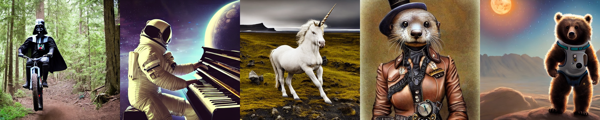
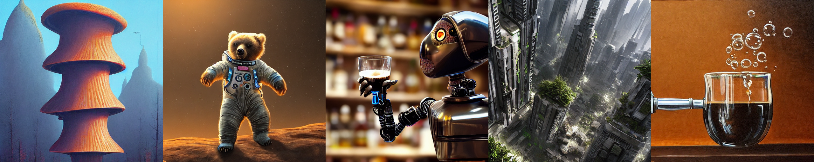
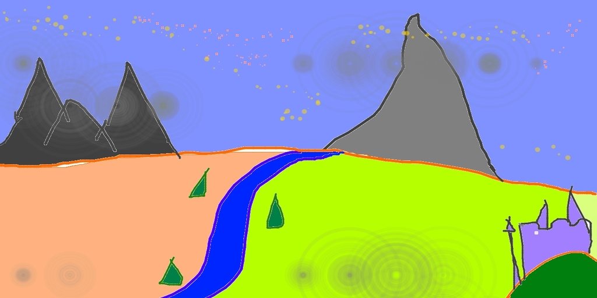

# Apple Silicon Mac Users

Several people have gotten Stable Diffusion to work on Apple Silicon Macs using Anaconda. I've gathered up most of their instructions and put them in this fork (and readme). I haven't tested anything besides Anaconda, and I've read about issues with things like miniforge, so if you have an issue that isn't dealt with in this fork then head on over to the [Apple Silicon](https://github.com/CompVis/stable-diffusion/issues/25) issue on GitHub (that page is so long that GitHub hides most of it by default, so you need to find the hidden part and expand it to view the whole thing). This fork would not have been possible without the work done by the people on that issue.

You have to have macOS 12.3 Monterey or later. Anything earlier than that won't work.

BTW, I haven't tested any of this on Intel Macs.

How to:

```
git clone https://github.com/magnusviri/stable-diffusion.git
cd stable-diffusion
git checkout apple-silicon-mps-support

mkdir -p models/ldm/stable-diffusion-v1/
ln -s /path/to/ckpt/sd-v1-1.ckpt models/ldm/stable-diffusion-v1/model.ckpt

conda env create -f environment-mac.yaml
conda activate ldm
```

These instructions are identical to the main repo except I added environment-mac.yaml because Mac doesn't have cudatoolkit.

After you follow all the instructions and run txt2img.py you might get several errors. Here's the errors I've seen and found solutions for.

### Doesn't work anymore?

We are using PyTorch nightly, which includes support for MPS. I don't know exactly how Anaconda does updates, but I woke up one morning and Stable Diffusion crashed and I couldn't think of anything I did that would've changed anything the night before, when it worked. A day and a half later I finally got it working again. I don't know what changed overnight. PyTorch-nightly changes overnight but I'm pretty sure I didn't manually update it. Either way, things are probably going to be bumpy on Apple Silicon until PyTorch releases a firm version that we can lock to.

To manually update to the latest version of PyTorch nightly (which could fix issues), run this command.

	conda install pytorch torchvision torchaudio -c pytorch-nightly

### "No module named cv2" (or some other module)

Did you remember to `conda activate ldm`? If your terminal prompt begins with "(ldm)" then you activated it. If it begins with "(base)" or something else you haven't.

If you have activated the ldm virtual environment, the problem could be that I have something installed that you don't and you'll just need to manually install it. 

	pip install *name*

You might also need to install Rust (I mention this again below).

### "The operator [name] is not current implemented for the MPS device." (sic)

Example error.

```
...
NotImplementedError: The operator 'aten::index.Tensor' is not current implemented for the MPS device. If you want this op to be added in priority during the prototype phase of this feature, please comment on [https://github.com/pytorch/pytorch/issues/77764](https://github.com/pytorch/pytorch/issues/77764). As a temporary fix, you can set the environment variable `PYTORCH_ENABLE_MPS_FALLBACK=1` to use the CPU as a fallback for this op. WARNING: this will be slower than running natively on MPS.
```

Just do what it says:

	export PYTORCH_ENABLE_MPS_FALLBACK=1

### "Could not build wheels for tokenizers"

I have not seen this error because I had Rust installed on my computer before I started playing with Stable Diffusion. The fix is to install Rust.

	curl --proto '=https' --tlsv1.2 -sSf https://sh.rustup.rs | sh

### How come `--seed` doesn't work?

> Completely reproducible results are not guaranteed across PyTorch releases, individual commits, or different platforms. Furthermore, results may not be reproducible between CPU and GPU executions, even when using identical seeds.

[PyTorch docs](https://pytorch.org/docs/stable/notes/randomness.html)

There is an [open issue](https://github.com/pytorch/pytorch/issues/78035) (as of August 2022) in pytorch regarding gradient inconsistency. I am guessing that's what is causing this.

### libiomp5.dylib error?

	OMP: Error #15: Initializing libiomp5.dylib, but found libomp.dylib already initialized.

There are several things you can do. First, you could use something besides Anaconda like miniforge. I read a lot of things online telling people to use something else, but I am stuck with Anaconda for other reasons.

Or you can try this.

	export KMP_DUPLICATE_LIB_OK=True

Or this (which takes forever on my computer and didn't work anyway).

	conda install nomkl

This error happens with Anaconda on Macs, and [nomkl](https://stackoverflow.com/questions/66224879/what-is-the-nomkl-python-package-used-for) is supposed to fix the issue (it isn't a module but a fix of some sort). [There's more suggestions](https://stackoverflow.com/questions/53014306/error-15-initializing-libiomp5-dylib-but-found-libiomp5-dylib-already-initial), like uninstalling tensorflow and reinstalling. I haven't tried them.

### Not enough memory.

This seems to be a common problem and is probably the underlying problem for a lot of symptoms (listed below). The fix is to lower your image size or to add `model.half()` right after the model is loaded. I should probably test it out. I've read that the reason this fixes problems is because it converts the model from 32-bit to 16-bit and that leaves more RAM for other things. I have no idea how that would affect the quality of the images though.

See [this issue](https://github.com/CompVis/stable-diffusion/issues/71).

### "Error: product of dimension sizes > 2**31'"

This error happens with img2img, which I haven't played with too much yet. But I know it's because your image is too big or the resolution isn't a multiple of 32x32. Because the stable-diffusion model was trained on images that were 512 x 512, it's always best to use that output size (which is the default). However, if you're using that size and you get the above error, try 256 x 256 or 512 x 256 or something as the source image.

BTW, 2**31-1 = [2,147,483,647](https://en.wikipedia.org/wiki/2,147,483,647#In_computing), which is also 32-bit signed [LONG_MAX](https://en.wikipedia.org/wiki/C_data_types) in C.

### I just got Rickrolled! Do I have a virus?

You don't have a virus. It's part of the project. Here's [Rick](https://github.com/magnusviri/stable-diffusion/blob/main/assets/rick.jpeg) and here's [the code](https://github.com/magnusviri/stable-diffusion/blob/69ae4b35e0a0f6ee1af8bb9a5d0016ccb27e36dc/scripts/txt2img.py#L79) that swaps him in. It's a NSFW filter, which IMO, doesn't work very good (and we call this "computer vision", sheesh).

Actually, this could be happening because there's not enough RAM. You could try the `model.half()` suggestion or specify smaller output images.

### My images come out black

I haven't solved this issue. I just throw away my black images. There's a [similar issue](https://github.com/CompVis/stable-diffusion/issues/69) on CUDA GPU's where the images come out green. Maybe it's the same issue? Someone in that issue says to use "--precision full", but this fork actually disables that flag. I don't know why, someone else provided that code and I don't know what it does. Maybe the `model.half()` suggestion above would fix this issue too. I should probably test it.

### "view size is not compatible with input tensor's size and stride"

```
  File "/opt/anaconda3/envs/ldm/lib/python3.10/site-packages/torch/nn/functional.py", line 2511, in layer_norm
    return torch.layer_norm(input, normalized_shape, weight, bias, eps, torch.backends.cudnn.enabled)
RuntimeError: view size is not compatible with input tensor's size and stride (at least one dimension spans across two contiguous subspaces). Use .reshape(...) instead.
```

Update to the latest version of magnusviri/stable-diffusion. We were patching pytorch but we found a file in stable-diffusion that we could change instead. This is a 32-bit vs 16-bit problem.

### Still slow?

I changed the defaults of n_samples and n_iter to 1 so that it uses less RAM and makes less images so it will be faster the first time you use it. I don't actually know what n_samples does internally, but I know it consumes a lot more RAM. The n_iter flag just loops around the image creation code, so it shouldn't consume more RAM (it should be faster if you're going to do multiple images because the libraries and model will already be loaded--use a prompt file to get this speed boost).

These flags are the default sample and iter settings in this fork/branch:

	python scripts/txt2img.py --prompt "ocean" --n_samples=1 --n_iter=1

Happy fuzzy internet image copying!

# Stable Diffusion
*Stable Diffusion was made possible thanks to a collaboration with [Stability AI](https://stability.ai/) and [Runway](https://runwayml.com/) and builds upon our previous work:*

[**High-Resolution Image Synthesis with Latent Diffusion Models**](https://ommer-lab.com/research/latent-diffusion-models/)<br/>
[Robin Rombach](https://github.com/rromb)\*,
[Andreas Blattmann](https://github.com/ablattmann)\*,
[Dominik Lorenz](https://github.com/qp-qp)\,
[Patrick Esser](https://github.com/pesser),
[Björn Ommer](https://hci.iwr.uni-heidelberg.de/Staff/bommer)<br/>
_[CVPR '22 Oral](https://openaccess.thecvf.com/content/CVPR2022/html/Rombach_High-Resolution_Image_Synthesis_With_Latent_Diffusion_Models_CVPR_2022_paper.html) |
[GitHub](https://github.com/CompVis/latent-diffusion) | [arXiv](https://arxiv.org/abs/2112.10752) | [Project page](https://ommer-lab.com/research/latent-diffusion-models/)_


[Stable Diffusion](#stable-diffusion-v1) is a latent text-to-image diffusion
model.
Thanks to a generous compute donation from [Stability AI](https://stability.ai/) and support from [LAION](https://laion.ai/), we were able to train a Latent Diffusion Model on 512x512 images from a subset of the [LAION-5B](https://laion.ai/blog/laion-5b/) database. 
Similar to Google's [Imagen](https://arxiv.org/abs/2205.11487), 
this model uses a frozen CLIP ViT-L/14 text encoder to condition the model on text prompts.
With its 860M UNet and 123M text encoder, the model is relatively lightweight and runs on a GPU with at least 10GB VRAM.
See [this section](#stable-diffusion-v1) below and the [model card](https://huggingface.co/CompVis/stable-diffusion).

  
## Requirements
A suitable [conda](https://conda.io/) environment named `ldm` can be created
and activated with:

```
conda env create -f environment.yaml
conda activate ldm
```

You can also update an existing [latent diffusion](https://github.com/CompVis/latent-diffusion) environment by running

```
conda install pytorch torchvision -c pytorch
pip install transformers==4.19.2 diffusers invisible-watermark
pip install -e .
``` 


## Stable Diffusion v1

Stable Diffusion v1 refers to a specific configuration of the model
architecture that uses a downsampling-factor 8 autoencoder with an 860M UNet
and CLIP ViT-L/14 text encoder for the diffusion model. The model was pretrained on 256x256 images and 
then finetuned on 512x512 images.

*Note: Stable Diffusion v1 is a general text-to-image diffusion model and therefore mirrors biases and (mis-)conceptions that are present
in its training data. 
Details on the training procedure and data, as well as the intended use of the model can be found in the corresponding [model card](Stable_Diffusion_v1_Model_Card.md).*

The weights are available via [the CompVis organization at Hugging Face](https://huggingface.co/CompVis) under [a license which contains specific use-based restrictions to prevent misuse and harm as informed by the model card, but otherwise remains permissive](LICENSE). While commercial use is permitted under the terms of the license, **we do not recommend using the provided weights for services or products without additional safety mechanisms and considerations**, since there are [known limitations and biases](Stable_Diffusion_v1_Model_Card.md#limitations-and-bias) of the weights, and research on safe and ethical deployment of general text-to-image models is an ongoing effort. **The weights are research artifacts and should be treated as such.**

[The CreativeML OpenRAIL M license](LICENSE) is an [Open RAIL M license](https://www.licenses.ai/blog/2022/8/18/naming-convention-of-responsible-ai-licenses), adapted from the work that [BigScience](https://bigscience.huggingface.co/) and [the RAIL Initiative](https://www.licenses.ai/) are jointly carrying in the area of responsible AI licensing. See also [the article about the BLOOM Open RAIL license](https://bigscience.huggingface.co/blog/the-bigscience-rail-license) on which our license is based.

### Weights

We currently provide the following checkpoints:

- `sd-v1-1.ckpt`: 237k steps at resolution `256x256` on [laion2B-en](https://huggingface.co/datasets/laion/laion2B-en).
  194k steps at resolution `512x512` on [laion-high-resolution](https://huggingface.co/datasets/laion/laion-high-resolution) (170M examples from LAION-5B with resolution `>= 1024x1024`).
- `sd-v1-2.ckpt`: Resumed from `sd-v1-1.ckpt`.
  515k steps at resolution `512x512` on [laion-aesthetics v2 5+](https://laion.ai/blog/laion-aesthetics/) (a subset of laion2B-en with estimated aesthetics score `> 5.0`, and additionally
filtered to images with an original size `>= 512x512`, and an estimated watermark probability `< 0.5`. The watermark estimate is from the [LAION-5B](https://laion.ai/blog/laion-5b/) metadata, the aesthetics score is estimated using the [LAION-Aesthetics Predictor V2](https://github.com/christophschuhmann/improved-aesthetic-predictor)).
- `sd-v1-3.ckpt`: Resumed from `sd-v1-2.ckpt`. 195k steps at resolution `512x512` on "laion-aesthetics v2 5+" and 10\% dropping of the text-conditioning to improve [classifier-free guidance sampling](https://arxiv.org/abs/2207.12598).
- `sd-v1-4.ckpt`: Resumed from `sd-v1-2.ckpt`. 225k steps at resolution `512x512` on "laion-aesthetics v2 5+" and 10\% dropping of the text-conditioning to improve [classifier-free guidance sampling](https://arxiv.org/abs/2207.12598).

Evaluations with different classifier-free guidance scales (1.5, 2.0, 3.0, 4.0,
5.0, 6.0, 7.0, 8.0) and 50 PLMS sampling
steps show the relative improvements of the checkpoints:


### Text-to-Image with Stable Diffusion



Stable Diffusion is a latent diffusion model conditioned on the (non-pooled) text embeddings of a CLIP ViT-L/14 text encoder.
We provide a [reference script for sampling](#reference-sampling-script), but
there also exists a [diffusers integration](#diffusers-integration), which we
expect to see more active community development.

#### Reference Sampling Script

We provide a reference sampling script, which incorporates

- a [Safety Checker Module](https://github.com/CompVis/stable-diffusion/pull/36),
  to reduce the probability of explicit outputs,
- an [invisible watermarking](https://github.com/ShieldMnt/invisible-watermark)
  of the outputs, to help viewers [identify the images as machine-generated](scripts/tests/test_watermark.py).

After [obtaining the `stable-diffusion-v1-*-original` weights](#weights), link them
```
mkdir -p models/ldm/stable-diffusion-v1/
ln -s <path/to/model.ckpt> models/ldm/stable-diffusion-v1/model.ckpt 
```
and sample with
```
python scripts/txt2img.py --prompt "a photograph of an astronaut riding a horse" --plms 
```

By default, this uses a guidance scale of `--scale 7.5`, [Katherine Crowson's implementation](https://github.com/CompVis/latent-diffusion/pull/51) of the [PLMS](https://arxiv.org/abs/2202.09778) sampler, 
and renders images of size 512x512 (which it was trained on) in 50 steps. All supported arguments are listed below (type `python scripts/txt2img.py --help`).


```commandline
usage: txt2img.py [-h] [--prompt [PROMPT]] [--outdir [OUTDIR]] [--skip_grid] [--skip_save] [--ddim_steps DDIM_STEPS] [--plms] [--laion400m] [--fixed_code] [--ddim_eta DDIM_ETA]
                  [--n_iter N_ITER] [--H H] [--W W] [--C C] [--f F] [--n_samples N_SAMPLES] [--n_rows N_ROWS] [--scale SCALE] [--from-file FROM_FILE] [--config CONFIG] [--ckpt CKPT]
                  [--seed SEED] [--precision {full,autocast}]

optional arguments:
  -h, --help            show this help message and exit
  --prompt [PROMPT]     the prompt to render
  --outdir [OUTDIR]     dir to write results to
  --skip_grid           do not save a grid, only individual samples. Helpful when evaluating lots of samples
  --skip_save           do not save individual samples. For speed measurements.
  --ddim_steps DDIM_STEPS
                        number of ddim sampling steps
  --plms                use plms sampling
  --laion400m           uses the LAION400M model
  --fixed_code          if enabled, uses the same starting code across samples
  --ddim_eta DDIM_ETA   ddim eta (eta=0.0 corresponds to deterministic sampling
  --n_iter N_ITER       sample this often
  --H H                 image height, in pixel space
  --W W                 image width, in pixel space
  --C C                 latent channels
  --f F                 downsampling factor
  --n_samples N_SAMPLES
                        how many samples to produce for each given prompt. A.k.a. batch size
  --n_rows N_ROWS       rows in the grid (default: n_samples)
  --scale SCALE         unconditional guidance scale: eps = eps(x, empty) + scale * (eps(x, cond) - eps(x, empty))
  --from-file FROM_FILE
                        if specified, load prompts from this file
  --config CONFIG       path to config which constructs model
  --ckpt CKPT           path to checkpoint of model
  --seed SEED           the seed (for reproducible sampling)
  --precision {full,autocast}
                        evaluate at this precision
```
Note: The inference config for all v1 versions is designed to be used with EMA-only checkpoints. 
For this reason `use_ema=False` is set in the configuration, otherwise the code will try to switch from
non-EMA to EMA weights. If you want to examine the effect of EMA vs no EMA, we provide "full" checkpoints
which contain both types of weights. For these, `use_ema=False` will load and use the non-EMA weights.


#### Diffusers Integration

A simple way to download and sample Stable Diffusion is by using the [diffusers library](https://github.com/huggingface/diffusers/tree/main#new--stable-diffusion-is-now-fully-compatible-with-diffusers):
```py
# make sure you're logged in with `huggingface-cli login`
from torch import autocast
from diffusers import StableDiffusionPipeline

pipe = StableDiffusionPipeline.from_pretrained(
	"CompVis/stable-diffusion-v1-4", 
	use_auth_token=True
).to("cuda")

prompt = "a photo of an astronaut riding a horse on mars"
with autocast("cuda"):
    image = pipe(prompt)["sample"][0]  
    
image.save("astronaut_rides_horse.png")
```


### Image Modification with Stable Diffusion

By using a diffusion-denoising mechanism as first proposed by [SDEdit](https://arxiv.org/abs/2108.01073), the model can be used for different 
tasks such as text-guided image-to-image translation and upscaling. Similar to the txt2img sampling script, 
we provide a script to perform image modification with Stable Diffusion.  

The following describes an example where a rough sketch made in [Pinta](https://www.pinta-project.com/) is converted into a detailed artwork.
```
python scripts/img2img.py --prompt "A fantasy landscape, trending on artstation" --init-img <path-to-img.jpg> --strength 0.8
```
Here, strength is a value between 0.0 and 1.0, that controls the amount of noise that is added to the input image. 
Values that approach 1.0 allow for lots of variations but will also produce images that are not semantically consistent with the input. See the following example.

**Input**



**Outputs**


This procedure can, for example, also be used to upscale samples from the base model.


## Comments 

- Our codebase for the diffusion models builds heavily on [OpenAI's ADM codebase](https://github.com/openai/guided-diffusion)
and [https://github.com/lucidrains/denoising-diffusion-pytorch](https://github.com/lucidrains/denoising-diffusion-pytorch). 
Thanks for open-sourcing!

- The implementation of the transformer encoder is from [x-transformers](https://github.com/lucidrains/x-transformers) by [lucidrains](https://github.com/lucidrains?tab=repositories). 


## BibTeX

```
@misc{rombach2021highresolution,
      title={High-Resolution Image Synthesis with Latent Diffusion Models}, 
      author={Robin Rombach and Andreas Blattmann and Dominik Lorenz and Patrick Esser and Björn Ommer},
      year={2021},
      eprint={2112.10752},
      archivePrefix={arXiv},
      primaryClass={cs.CV}
}
```


