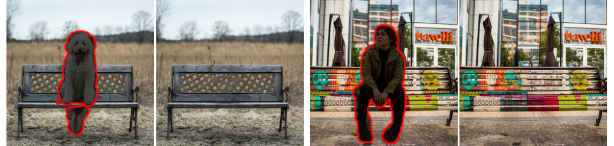

# Latent Diffusion Models

## Requirements
A suitable [conda](https://conda.io/) environment named `ldm` can be created
and activated with:

```
conda env create -f environment.yaml
conda activate ldm
```

# Model Zoo 

## Pretrained Autoencoding Models


| Model                   | FID vs val | PSNR           | PSIM          | Link                                                                                                                                                  | Comments              
|-------------------------|------------|----------------|---------------|-------------------------------------------------------------------------------------------------------------------------------------------------------|-----------------------|
| f=4, VQ (Z=8192, d=3)   | 0.58       | 27.43  +/- 4.26 | 0.53 +/- 0.21 |     https://ommer-lab.com/files/latent-diffusion/vq-f4.zip                   |  |
| f=4, VQ (Z=8192, d=3)   | 1.06       | 25.21 +/-  4.17 | 0.72 +/- 0.26 | https://heibox.uni-heidelberg.de/f/9c6681f64bb94338a069/?dl=1  | no attention          |
| f=8, VQ (Z=16384, d=4)  | 1.14       | 23.07 +/- 3.99 | 1.17 +/- 0.36 |       https://ommer-lab.com/files/latent-diffusion/vq-f8.zip                     |                       |
| f=8, VQ (Z=256, d=4)    | 1.49       | 22.35 +/- 3.81 | 1.26 +/- 0.37 |   https://ommer-lab.com/files/latent-diffusion/vq-f8-n256.zip |  
| f=16, VQ (Z=16384, d=8) | 5.15       | 20.83 +/- 3.61 | 1.73 +/- 0.43 |             https://heibox.uni-heidelberg.de/f/0e42b04e2e904890a9b6/?dl=1                        |                       |
|                         |            |                |               |                                                                                                                                                    |                       |
| f=4, KL                 | 0.27       | 27.53 +/- 4.54 | 0.55 +/- 0.24 |     https://ommer-lab.com/files/latent-diffusion/kl-f4.zip                                   |                       |
| f=8, KL                 | 0.90       | 24.19 +/- 4.19 | 1.02 +/- 0.35 |             https://ommer-lab.com/files/latent-diffusion/kl-f8.zip                            |                       |
| f=16, KL     (d=16)     | 0.87       | 24.08 +/- 4.22 | 1.07 +/- 0.36 |      https://ommer-lab.com/files/latent-diffusion/kl-f16.zip                                  |                       |
 | f=32, KL     (d=64)     | 2.04       | 22.27 +/- 3.93 | 1.41 +/- 0.40 |             https://ommer-lab.com/files/latent-diffusion/kl-f32.zip                            |                       |

### Get the models

Running the following script downloads und extracts all available pretrained autoencoding models.   

```shell script
bash scripts/download_first_stages.sh
```

The first stage models can then be found in `models/first_stage_models/<model_spec>`

## Pretrained LDMs
| Datset                          |   Task    | Model        | FID           | IS              | Prec | Recall | Link                                                                                                                                                                                   | Comments                                        
|---------------------------------|------|--------------|---------------|-----------------|------|------|----------------------------------------------------------------------------------------------------------------------------------------------------------------------------------------|-------------------------------------------------|
| CelebA-HQ                       | Unconditional Image Synthesis    |  LDM-VQ-4 (200 DDIM steps, eta=0)| 5.11 (5.11)          | 3.29            | 0.72    | 0.49 |    https://ommer-lab.com/files/latent-diffusion/celeba.zip     |                                                 |  
| FFHQ                            | Unconditional Image Synthesis    |  LDM-VQ-4 (200 DDIM steps, eta=1)| 4.98 (4.98)  | 4.50 (4.50)   | 0.73 | 0.50 |              https://ommer-lab.com/files/latent-diffusion/ffhq.zip                                              |                                                 |
| LSUN-Churches                   | Unconditional Image Synthesis   |  LDM-KL-8 (400 DDIM steps, eta=0)| 4.02 (4.02) | 2.72 | 0.64 | 0.52 |         https://ommer-lab.com/files/latent-diffusion/lsun_churches.zip        |                                                 |  
| LSUN-Bedrooms                   | Unconditional Image Synthesis   |  LDM-VQ-4 (200 DDIM steps, eta=1)| 2.95 (3.0)          | 2.22 (2.23)| 0.66 | 0.48 | https://ommer-lab.com/files/latent-diffusion/lsun_bedrooms.zip |                                                 |  
| ImageNet                        | Class-conditional Image Synthesis | LDM-VQ-8 (200 DDIM steps, eta=1) | 7.77(7.76)* /15.82** | 201.56(209.52)* /78.82** | 0.84* / 0.65** | 0.35* / 0.63** |   https://ommer-lab.com/files/latent-diffusion/cin.zip                                                                   | *: w/ guiding, classifier_scale 10  **: w/o guiding, scores in bracket calculated with script provided by [ADM](https://github.com/openai/guided-diffusion) |   
| Conceptual Captions             |  Text-conditional Image Synthesis | LDM-VQ-f4 (100 DDIM steps, eta=0) | 16.79         | 13.89           | N/A | N/A |              https://ommer-lab.com/files/latent-diffusion/text2img.zip                                | finetuned from LAION                            |   
| OpenImages                      | Super-resolution   | N/A           | N/A            | N/A               | N/A    | N/A    |                                    https://ommer-lab.com/files/latent-diffusion/sr_bsr.zip                                    | BSR image degradation                           |
| OpenImages                      | Layout-to-Image Synthesis    | LDM-VQ-4 (200 DDIM steps, eta=0) | 32.02         | 15.92           | N/A    | N/A    |                  https://ommer-lab.com/files/latent-diffusion/layout2img_model.zip                                           |                                                 | 
| Landscapes      (finetuned 512) |  Semantic Image Synthesis   | LDM-VQ-4 (100 DDIM steps, eta=1) | N/A             | N/A               | N/A    | N/A    |           https://ommer-lab.com/files/latent-diffusion/semantic_synthesis.zip                                    |                                                 |


### Get the models

The LDMs listed above can jointly be downloaded and extracted via

```shell script
bash scripts/download_models.sh
```

The models can then be found in `models/ldm/<model_spec>`.

### Sampling with unconditional models

We provide a first script for sampling from our unconditional models. Start it via

```shell script
CUDA_VISIBLE_DEVICES=<GPU_ID> python scripts/sample_diffusion.py -r models/ldm/<model_spec>/model.ckpt -l <logdir> -n <\#samples> --batch_size <batch_size> -c <\#ddim steps> -e <\#eta> 
```

## Coming Soon...



* Code for training LDMs and the corresponding compression models.
* Inference scripts for conditional LDMs for various conditioning modalities.
* In the meantime, you can play with our colab notebook https://colab.research.google.com/drive/1xqzUi2iXQXDqXBHQGP9Mqt2YrYW6cx-J?usp=sharing
* We will also release some further pretrained models.


## Comments 

- Our codebase for the diffusion models builds heavily on [OpenAI's codebase](https://github.com/openai/guided-diffusion)
and [https://github.com/lucidrains/denoising-diffusion-pytorch](https://github.com/lucidrains/denoising-diffusion-pytorch). 
Thanks for open-sourcing!

- The implementation of the transformer encoder is from [x-transformers](https://github.com/lucidrains/x-transformers) by [lucidrains](https://github.com/lucidrains?tab=repositories). 


