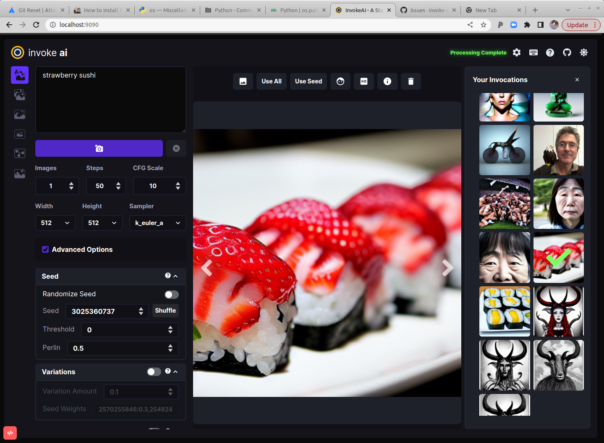

<div align="center">

# InvokeAI: A Stable Diffusion Toolkit

_Formally known as lstein/stable-diffusion_


[![discord badge]][discord link]

[![latest release badge]][latest release link] [![github stars badge]][github stars link] [![github forks badge]][github forks link]

[![CI checks on main badge]][CI checks on main link] [![CI checks on dev badge]][CI checks on dev link] [![latest commit to dev badge]][latest commit to dev link]

[![github open issues badge]][github open issues link] [![github open prs badge]][github open prs link]

[CI checks on dev badge]: https://flat.badgen.net/github/checks/invoke-ai/InvokeAI/development?label=CI%20status%20on%20dev&cache=900&icon=github
[CI checks on dev link]: https://github.com/invoke-ai/InvokeAI/actions?query=branch%3Adevelopment
[CI checks on main badge]: https://flat.badgen.net/github/checks/invoke-ai/InvokeAI/main?label=CI%20status%20on%20main&cache=900&icon=github
[CI checks on main link]: https://github.com/invoke-ai/InvokeAI/actions/workflows/test-invoke-conda.yml
[discord badge]: https://flat.badgen.net/discord/members/ZmtBAhwWhy?icon=discord
[discord link]: https://discord.gg/ZmtBAhwWhy
[github forks badge]: https://flat.badgen.net/github/forks/invoke-ai/InvokeAI?icon=github
[github forks link]: https://useful-forks.github.io/?repo=invoke-ai%2FInvokeAI
[github open issues badge]: https://flat.badgen.net/github/open-issues/invoke-ai/InvokeAI?icon=github
[github open issues link]: https://github.com/invoke-ai/InvokeAI/issues?q=is%3Aissue+is%3Aopen
[github open prs badge]: https://flat.badgen.net/github/open-prs/invoke-ai/InvokeAI?icon=github
[github open prs link]: https://github.com/invoke-ai/InvokeAI/pulls?q=is%3Apr+is%3Aopen
[github stars badge]: https://flat.badgen.net/github/stars/invoke-ai/InvokeAI?icon=github
[github stars link]: https://github.com/invoke-ai/InvokeAI/stargazers
[latest commit to dev badge]: https://flat.badgen.net/github/last-commit/invoke-ai/InvokeAI/development?icon=github&color=yellow&label=last%20dev%20commit&cache=900
[latest commit to dev link]: https://github.com/invoke-ai/InvokeAI/commits/development
[latest release badge]: https://flat.badgen.net/github/release/invoke-ai/InvokeAI/development?icon=github
[latest release link]: https://github.com/invoke-ai/InvokeAI/releases
</div>

This is a fork of
[CompVis/stable-diffusion](https://github.com/CompVis/stable-diffusion),
the open source text-to-image generator. It provides a streamlined
process with various new features and options to aid the image
generation process. It runs on Windows, Mac and Linux machines, with
GPU cards with as little as 4 GB of RAM. It provides both a polished
Web interface (see below), and an easy-to-use command-line interface.

**Quick links**: [<a href="https://discord.gg/NwVCmKwY">Discord Server</a>] [<a href="https://invoke-ai.github.io/InvokeAI/">Documentation and Tutorials</a>] [<a href="https://github.com/invoke-ai/InvokeAI/">Code and Downloads</a>] [<a href="https://github.com/invoke-ai/InvokeAI/issues">Bug Reports</a>] [<a href="https://github.com/invoke-ai/InvokeAI/discussions">Discussion, Ideas & Q&A</a>]

<div align="center"></div>


_Note: This fork is rapidly evolving. Please use the
[Issues](https://github.com/invoke-ai/InvokeAI/issues) tab to report bugs and make feature
requests. Be sure to use the provided templates. They will help aid diagnose issues faster._

## Table of Contents

1. [Installation](#installation)
2. [Hardware Requirements](#hardware-requirements)
3. [Features](#features)
4. [Latest Changes](#latest-changes)
5. [Troubleshooting](#troubleshooting)
6. [Contributing](#contributing)
7. [Contributors](#contributors)
8. [Support](#support)
9. [Further Reading](#further-reading)

### Installation

This fork is supported across multiple platforms. You can find individual installation instructions
below.

- #### [Linux](docs/installation/INSTALL_LINUX.md)

- #### [Windows](docs/installation/INSTALL_WINDOWS.md)

- #### [Macintosh](docs/installation/INSTALL_MAC.md)

### Hardware Requirements

#### System

You wil need one of the following:

- An NVIDIA-based graphics card with 4 GB or more VRAM memory.
- An Apple computer with an M1 chip.

#### Memory

- At least 12 GB Main Memory RAM.

#### Disk

- At least 12 GB of free disk space for the machine learning model, Python, and all its dependencies.

**Note**

If you have a Nvidia 10xx series card (e.g. the 1080ti), please
run the dream script in full-precision mode as shown below.

Similarly, specify full-precision mode on Apple M1 hardware.

Precision is auto configured based on the device. If however you encounter
errors like 'expected type Float but found Half' or 'not implemented for Half'
you can try starting `invoke.py` with the `--precision=float32` flag:

```bash
(ldm) ~/stable-diffusion$ python scripts/invoke.py --precision=float32
```

### Features

#### Major Features

- [Web Server](docs/features/WEB.md)
- [Interactive Command Line Interface](docs/features/CLI.md)
- [Image To Image](docs/features/IMG2IMG.md)
- [Inpainting Support](docs/features/INPAINTING.md)
- [Outpainting Support](docs/features/OUTPAINTING.md)
- [Upscaling, face-restoration and outpainting](docs/features/POSTPROCESS.md)
- [Seamless Tiling](docs/features/OTHER.md#seamless-tiling)
- [Google Colab](docs/features/OTHER.md#google-colab)
- [Reading Prompts From File](docs/features/PROMPTS.md#reading-prompts-from-a-file)
- [Shortcut: Reusing Seeds](docs/features/OTHER.md#shortcuts-reusing-seeds)
- [Prompt Blending](docs/features/PROMPTS.md#prompt-blending)
- [Thresholding and Perlin Noise Initialization Options](/docs/features/OTHER.md#thresholding-and-perlin-noise-initialization-options)
- [Negative/Unconditioned Prompts](docs/features/PROMPTS.md#negative-and-unconditioned-prompts)
- [Variations](docs/features/VARIATIONS.md)
- [Personalizing Text-to-Image Generation](docs/features/TEXTUAL_INVERSION.md)
- [Simplified API for text to image generation](docs/features/OTHER.md#simplified-api)

#### Other Features

- [Creating Transparent Regions for Inpainting](docs/features/INPAINTING.md#creating-transparent-regions-for-inpainting)
- [Preload Models](docs/features/OTHER.md#preload-models)

### Latest Changes

- v2.0.1 (13 October 2022)
  - fix noisy images at high step count when using k* samplers
  - dream.py script now calls invoke.py module directly rather than
    via a new python process (which could break the environment)

- v2.0.0 (9 October 2022)

  - `dream.py` script renamed `invoke.py`. A `dream.py` script wrapper remains
    for backward compatibility.
  - Completely new WebGUI - launch with `python3 scripts/invoke.py --web`
  - Support for <a href="https://github.com/invoke-ai/InvokeAI/blob/main/docs/features/INPAINTING.md">inpainting</a> and <a href="https://github.com/invoke-ai/InvokeAI/blob/main/docs/features/OUTPAINTING.md">outpainting</a>
  - img2img runs on all k* samplers
  - Support for <a href="https://github.com/invoke-ai/InvokeAI/blob/main/docs/features/PROMPTS.md#negative-and-unconditioned-prompts">negative prompts</a>
  - Support for CodeFormer face reconstruction
  - Support for Textual Inversion on Macintoshes
  - Support in both WebGUI and CLI for <a href="https://github.com/invoke-ai/InvokeAI/blob/main/docs/features/POSTPROCESS.md">post-processing of previously-generated images</a>
    using facial reconstruction, ESRGAN upscaling, outcropping (similar to DALL-E infinite canvas),
    and "embiggen" upscaling. See the `!fix` command.
  - New `--hires` option on `invoke>` line allows <a href="https://github.com/invoke-ai/InvokeAI/blob/main/docs/features/CLI.md#this-is-an-example-of-txt2img">larger images to be created without duplicating elements</a>, at the cost of some performance.
  - New `--perlin` and `--threshold` options allow you to add and control variation
    during image generation (see <a href="https://github.com/invoke-ai/InvokeAI/blob/main/docs/features/OTHER.md#thresholding-and-perlin-noise-initialization-options">Thresholding and Perlin Noise Initialization</a>
  - Extensive metadata now written into PNG files, allowing reliable regeneration of images
    and tweaking of previous settings.
  - Command-line completion in `invoke.py` now works on Windows, Linux and Mac platforms.
  - Improved <a href="https://github.com/invoke-ai/InvokeAI/blob/main/docs/features/CLI.md">command-line completion behavior</a>.
    New commands added:
       * List command-line history with `!history`
       * Search command-line history with `!search`
       * Clear history with `!clear`
  - Deprecated `--full_precision` / `-F`. Simply omit it and `invoke.py` will auto
    configure. To switch away from auto use the new flag like `--precision=float32`.

For older changelogs, please visit the **[CHANGELOG](docs/features/CHANGELOG.md)**.

### Troubleshooting

Please check out our **[Q&A](docs/help/TROUBLESHOOT.md)** to get solutions for common installation
problems and other issues.

# Contributing

Anyone who wishes to contribute to this project, whether documentation, features, bug fixes, code
cleanup, testing, or code reviews, is very much encouraged to do so. If you are unfamiliar with how
to contribute to GitHub projects, here is a
[Getting Started Guide](https://opensource.com/article/19/7/create-pull-request-github).

A full set of contribution guidelines, along with templates, are in progress, but for now the most
important thing is to **make your pull request against the "development" branch**, and not against
"main". This will help keep public breakage to a minimum and will allow you to propose more radical
changes.

### Contributors

This fork is a combined effort of various people from across the world.
[Check out the list of all these amazing people](docs/other/CONTRIBUTORS.md). We thank them for
their time, hard work and effort.

### Support

For support, please use this repository's GitHub Issues tracking service. Feel free to send me an
email if you use and like the script.

Original portions of the software are Copyright (c) 2020
[Lincoln D. Stein](https://github.com/lstein)

### Further Reading

Please see the original README for more information on this software and underlying algorithm,
located in the file [README-CompViz.md](docs/other/README-CompViz.md).
