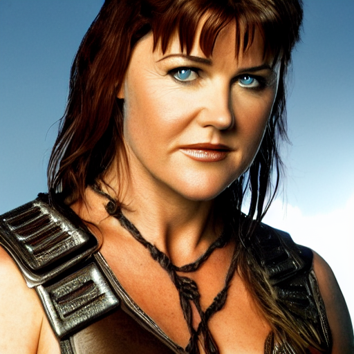
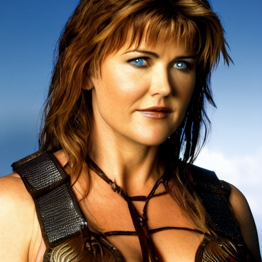
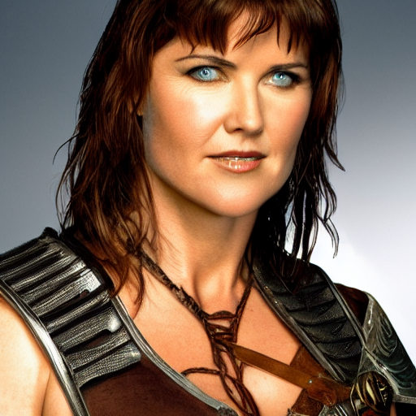
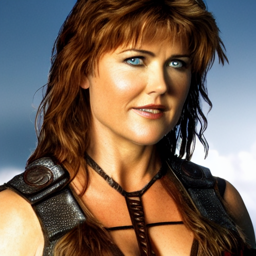
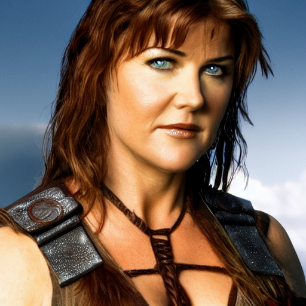

# Cheat Sheat for Generating Variations

Release 1.13 of SD-Dream adds support for image variations. There are two things that you can do:

1. Generate a series of systematic variations of an image, given a
prompt. The amount of variation from one image to the next can be
controlled.

2. Given two or more variations that you like, you can combine them in
a weighted fashion

This cheat sheet provides a quick guide for how this works in
practice, using variations to create the desired image of Xena,
Warrior Princess.

## Step 1 -- find a base image that you like

The prompt we will use throughout is "lucy lawless as xena, warrior
princess, character portrait, high resolution." This will be indicated
as "prompt" in the examples below.

First we let SD create a series of images in the usual way, in this case
requesting six iterations:

~~~
dream> lucy lawless as xena, warrior princess, character portrait, high resolution -n6
...
Outputs:
./outputs/Xena/000001.1579445059.png: "prompt" -s50 -W512 -H512 -C7.5 -Ak_lms -S1579445059
./outputs/Xena/000001.1880768722.png: "prompt" -s50 -W512 -H512 -C7.5 -Ak_lms -S1880768722
./outputs/Xena/000001.332057179.png: "prompt" -s50 -W512 -H512 -C7.5 -Ak_lms -S332057179
./outputs/Xena/000001.2224800325.png: "prompt" -s50 -W512 -H512 -C7.5 -Ak_lms -S2224800325
./outputs/Xena/000001.465250761.png: "prompt" -s50 -W512 -H512 -C7.5 -Ak_lms -S465250761
./outputs/Xena/000001.3357757885.png: "prompt" -s50 -W512 -H512 -C7.5 -Ak_lms -S3357757885
~~~

The one with seed 3357757885 looks nice:

Let's try to generate some variations. Using the same seed, we pass
the argument -v0.1 (or --variant_amount), which generates a series of
variations each differing by a variation amount of 0.2. This number
ranges from 0 to 1.0, with higher numbers being larger amounts of
variation.

~~~
dream> "prompt" -n6 -S3357757885 -v0.2
...
Outputs:
./outputs/Xena/000002.784039624.png: "prompt" -s50 -W512 -H512 -C7.5 -Ak_lms -V 784039624:0.2 -S3357757885
./outputs/Xena/000002.3647897225.png: "prompt" -s50 -W512 -H512 -C7.5 -Ak_lms -V 3647897225:0.2 -S3357757885
./outputs/Xena/000002.917731034.png: "prompt" -s50 -W512 -H512 -C7.5 -Ak_lms -V 917731034:0.2 -S3357757885
./outputs/Xena/000002.4116285959.png: "prompt" -s50 -W512 -H512 -C7.5 -Ak_lms -V 4116285959:0.2 -S3357757885
./outputs/Xena/000002.1614299449.png: "prompt" -s50 -W512 -H512 -C7.5 -Ak_lms -V 1614299449:0.2 -S3357757885
./outputs/Xena/000002.1335553075.png: "prompt" -s50 -W512 -H512 -C7.5 -Ak_lms -V 1335553075:0.2 -S3357757885
~~~

Note that the output for each image has a -V option giving the
"variant subseed" for that image, consisting of a seed followed by the
variation amount used to generate it.

This gives us a series of closely-related variations, including the
two shown here.

I like the expression on Xena's face in the first one (subseed
3647897225), and the armor on her shoulder in the second one (subseed
1614299449). Can we combine them to get the best of both worlds?

We combine the two variations using -V (--with_variations). Again, we
must provide the seed for the originally-chosen image in order for
this to work.

~~~
dream> "prompt"  -S3357757885 -V3647897225,0.1;1614299449,0.1
Outputs:
./outputs/Xena/000003.1614299449.png: "prompt" -s50 -W512 -H512 -C7.5 -Ak_lms -V 3647897225:0.1,1614299449:0.1 -S3357757885
~~~

Here we are providing equal weights (0.1 and 0.1) for both the
subseeds. The resulting image is close, but not exactly what I
wanted:

We could either try combining the images with different weights, or we
can generate more variations around the almost-but-not-quite image. We
do the latter, using both the -V (combining) and -v (variation
strength) options. Note that we use -n6 to generate 6 variations:

~~~~
dream> "prompt" -S3357757885 -V3647897225,0.1;1614299449,0.1 -v0.05 -n6
Outputs:
./outputs/Xena/000004.3279757577.png: "prompt" -s50 -W512 -H512 -C7.5 -Ak_lms -V 3647897225:0.1,1614299449:0.1,3279757577:0.05 -S3357757885
./outputs/Xena/000004.2853129515.png: "prompt" -s50 -W512 -H512 -C7.5 -Ak_lms -V 3647897225:0.1,1614299449:0.1,2853129515:0.05 -S3357757885
./outputs/Xena/000004.3747154981.png: "prompt" -s50 -W512 -H512 -C7.5 -Ak_lms -V 3647897225:0.1,1614299449:0.1,3747154981:0.05 -S3357757885
./outputs/Xena/000004.2664260391.png: "prompt" -s50 -W512 -H512 -C7.5 -Ak_lms -V 3647897225:0.1,1614299449:0.1,2664260391:0.05 -S3357757885
./outputs/Xena/000004.1642517170.png: "prompt" -s50 -W512 -H512 -C7.5 -Ak_lms -V 3647897225:0.1,1614299449:0.1,1642517170:0.05 -S3357757885
./outputs/Xena/000004.2183375608.png: "prompt" -s50 -W512 -H512 -C7.5 -Ak_lms -V 3647897225:0.1,1614299449:0.1,2183375608:0.05 -S3357757885
~~~~

This produces six images, all slight variations on the combination of
the chosen two images. Here's the one I like best:

As you can see, this is a very powerful tool, which when combined with
subprompt weighting, gives you great control over the content and
quality of your generated images.
