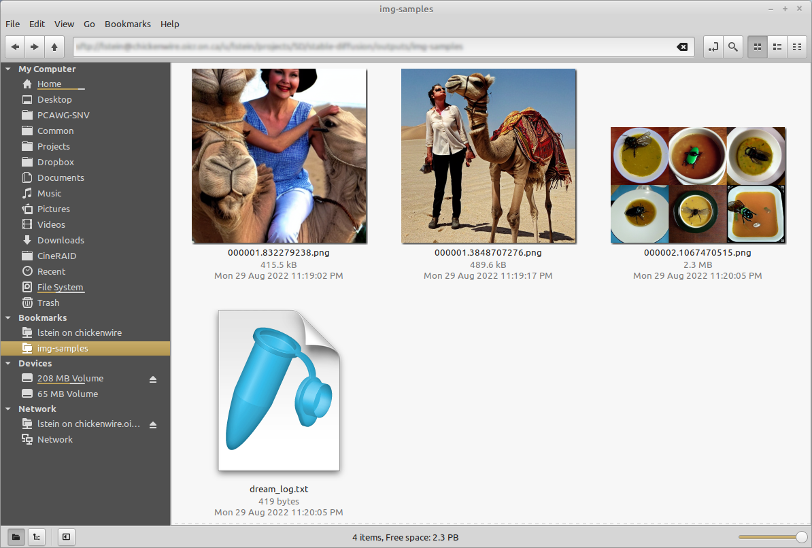

## **Interactive Command Line Interface**

The `dream.py` script, located in `scripts/dream.py`, provides an interactive interface to image
generation similar to the "dream mothership" bot that Stable AI provided on its Discord server.

Unlike the txt2img.py and img2img.py scripts provided in the original CompViz/stable-diffusion
source code repository, the time-consuming initialization of the AI model initialization only
happens once. After that image generation from the command-line interface is very fast.

The script uses the readline library to allow for in-line editing, command history (up and down
arrows), autocompletion, and more. To help keep track of which prompts generated which images, the
script writes a log file of image names and prompts to the selected output directory.

In addition, as of version 1.02, it also writes the prompt into the PNG file's metadata where it can
be retrieved using scripts/images2prompt.py

The script is confirmed to work on Linux, Windows and Mac systems.

_Note:_ This script runs from the command-line or can be used as a Web application. The Web GUI is
currently rudimentary, but a much better replacement is on its way.

```bash
(ldm) ~/stable-diffusion$ python3 ./scripts/dream.py
* Initializing, be patient...
Loading model from models/ldm/text2img-large/model.ckpt
(...more initialization messages...)

* Initialization done! Awaiting your command...
dream> ashley judd riding a camel -n2 -s150
Outputs:
   outputs/img-samples/00009.png: "ashley judd riding a camel" -n2 -s150 -S 416354203
   outputs/img-samples/00010.png: "ashley judd riding a camel" -n2 -s150 -S 1362479620

dream> "there's a fly in my soup" -n6 -g
    outputs/img-samples/00011.png: "there's a fly in my soup" -n6 -g -S 2685670268
    seeds for individual rows: [2685670268, 1216708065, 2335773498, 822223658, 714542046, 3395302430]
dream> q

# this shows how to retrieve the prompt stored in the saved image's metadata
(ldm) ~/stable-diffusion$ python ./scripts/images2prompt.py outputs/img_samples/*.png
00009.png: "ashley judd riding a camel" -s150 -S 416354203
00010.png: "ashley judd riding a camel" -s150 -S 1362479620
00011.png: "there's a fly in my soup" -n6 -g -S 2685670268
```

<p align='center'>

</p>

The `dream>` prompt's arguments are pretty much identical to those used in the Discord bot, except
you don't need to type "!dream" (it doesn't hurt if you do). A significant change is that creation
of individual images is now the default unless --grid (-g) is given. A full list is given in [List
of prompt arguments] (#list-of-prompt-arguments).

## Arguments

The script itself also recognizes a series of command-line switches that will change important
global defaults, such as the directory for image outputs and the location of the model weight files.

## List of arguments recognized at the command line

These command-line arguments can be passed to dream.py when you first run it from the Windows, Mac
or Linux command line. Some set defaults that can be overridden on a per-prompt basis (see [List of
prompt arguments] (#list-of-prompt-arguments). Others

| Argument                |  Shortcut   | Default                                          | Description                                                                                          |
| :---------------------- | :---------: | ------------------------------------------------ | ---------------------------------------------------------------------------------------------------- |
| --help                  |     -h      |                                                  | Print a concise help message.                                                                        |
| --outdir <path>         |  -o<path>   | outputs/img_samples                              | Location for generated images.                                                                       |
| --prompt_as_dir         |     -p      | False                                            | Name output directories using the prompt text.                                                       |
| --from_file <path>      |             | None                                             | Read list of prompts from a file. Use "-" to read from standard input                                |
| --model <modelname>     |             | stable-diffusion-1.4                             | Loads model specified in configs/models.yaml. Currently one of "stable-diffusion-1.4" or "laion400m" |
| --precision <pname>     |             | auto                                             | Set to a specific precision. Rare but you may need to switch to 'float32' on some video cards.       |
| --web                   |             | False                                            | Start in web server mode                                                                             |
| --host <ip addr>        |             | localhost                                        | Which network interface web server should listen on. Set to 0.0.0.0 to listen on any.                |
| --port <port>           |             | 9090                                             | Which port web server should listen for requests on.                                                 |
| --config <path>         |             | configs/models.yaml                              | Configuration file for models and their weights.                                                     |
| --iterations <int>      |   -n<int>   | 1                                                | How many images to generate per prompt.                                                              |
| --grid                  |     -g      | False                                            | Save all image series as a grid rather than individually.                                            |
| --sampler <sampler>     | -A<sampler> | k_lms                                            | Sampler to use. Use -h to get list of available samplers.                                            |
| --seamless              |             | False                                            | Create interesting effects by tiling elements of the image.                                          |
| --embedding_path <path> |             | None                                             | Path to pre-trained embedding manager checkpoints, for custom models                                 |
| --gfpgan_dir            |             | src/gfpgan                                       | Path to where GFPGAN is installed.                                                                   |
| --gfpgan_model_path     |             | experiments/pretrained_models<br>/GFPGANv1.3.pth | Path to GFPGAN model file, relative to --gfpgan_dir.                                                 |
| --device <device>       | -d<device>  | torch.cuda.current_device()                      | Device to run SD on, e.g. "cuda:0"                                                                   |

These arguments are deprecated but still work:

| Argument         | Shortcut | Default | Description                                                     |
| ---------------- | -------- | ------- | --------------------------------------------------------------- |
| --weights <path> |          | None    | Pth to weights file; use `--model stable-diffusion-1.4` instead |
| --laion400m      | -l       | False   | Use older LAION400m weights; use `--model=laion400m` instead    |

### **A note on path names:**

On Windows systems, you may run into problems when passing the dream script standard backslashed
path names because the Python interpreter treats "\" as an escape. You can either double your
slashes (ick): `C:\\\\path\\\\to\\\\my\\\\file`, or use Linux/Mac style forward slashes (better):
`C:/path/to/my/file`.

### List of prompt arguments

After the dream.py script initializes, it will present you with a **dream>** prompt. Here you can
enter information to generate images from text (txt2img), to embellish an existing image or sketch
(img2img), or to selectively alter chosen regions of the image (inpainting).

### This is an example of txt2img

```bash
dream> "waterfall and rainbow" -W640 -H480
```

This will create the requested image with the dimensions 640 (width) and 480 (height).

Those are the `dream` commands that apply to txt2img:

| Argument                    | Shortcut         | Default             | Description                                                                                                                                                                                                                                  |
| --------------------------- | ---------------- | ------------------- | -------------------------------------------------------------------------------------------------------------------------------------------------------------------------------------------------------------------------------------------- |
| "my prompt"                 |                  |                     | Text prompt to use. The quotation marks are optional.                                                                                                                                                                                        |
| --width <int>               | -W<int>          | 512                 | Width of generated image                                                                                                                                                                                                                     |
| --height <int>              | -H<int>          | 512                 | Height of generated image                                                                                                                                                                                                                    |
| --iterations <int>          | -n<int>          | 1                   | How many images to generate from this prompt                                                                                                                                                                                                 |
| --steps <int>               | -s<int>          | 50                  | How many steps of refinement to apply                                                                                                                                                                                                        |
| --cfg_scale <float>         | -C<float>        | 7.5                 | How hard to try to match the prompt to the generated image; any number greater than 0.0 works, but the useful range is roughly 5.0 to 20.0                                                                                                   |
| --seed <int>                | -S<int>          | None                | Set the random seed for the next series of images. This can be used to recreate an image generated previously.                                                                                                                               |
| --sampler <sampler>         | -A<sampler>      | k_lms               | Sampler to use. Use -h to get list of available samplers.                                                                                                                                                                                    |
| --grid                      | -g               | False               | Turn on grid mode to return a single image combining all the images generated by this prompt                                                                                                                                                 |
| --individual                | -i               | True                | Turn off grid mode (deprecated; leave off --grid instead)                                                                                                                                                                                    |
| --outdir <path>             | -o<path>         | outputs/img_samples | Temporarily change the location of these images                                                                                                                                                                                              |
| --seamless                  |                  | False               | Activate seamless tiling for interesting effects                                                                                                                                                                                             |
| --log_tokenization          | -t               | False               | Display a color-coded list of the parsed tokens derived from the prompt                                                                                                                                                                      |
| --skip_normalization        | -x               | False               | Weighted subprompts will not be normalized. See [Weighted Prompts](./OTHER.md#weighted-prompts)                                                                                                                                              |
| --upscale <int> <float>     | -U <int> <float> | -U 1 0.75           | Upscale image by magnification factor (2, 4), and set strength of upscaling (0.0-1.0). If strength not set, will default to 0.75.                                                                                                            |
| --gfpgan_strength <float>   | -G <float>       | -G0                 | Fix faces using the GFPGAN algorithm; argument indicates how hard the algorithm should try (0.0-1.0)                                                                                                                                         |
| --save_original             | -save_orig       | False               | When upscaling or fixing faces, this will cause the original image to be saved rather than replaced.                                                                                                                                         |
| --variation <float>         | -v<float>        | 0.0                 | Add a bit of noise (0.0=none, 1.0=high) to the image in order to generate a series of variations. Usually used in combination with -S<seed> and -n<int> to generate a series a riffs on a starting image. See [Variations](./VARIATIONS.md). |
| --with_variations <pattern> | -V<pattern>      | None                | Combine two or more variations. See [Variations](./VARIATIONS.md) for now to use this.                                                                                                                                                       |

Note that the width and height of the image must be multiples of 64. You can provide different
values, but they will be rounded down to the nearest multiple of 64.

### This is an example of img2img

```bash
dream> waterfall and rainbow -I./vacation-photo.png -W640 -H480 --fit
```

This will modify the indicated vacation photograph by making it more like the prompt. Results will
vary greatly depending on what is in the image. We also ask to --fit the image into a box no bigger
than 640x480. Otherwise the image size will be identical to the provided photo and you may run out
of memory if it is large.

Repeated chaining of img2img on an image can result in significant color shifts
in the output, especially if run with lower strength. Color correction can be
run against a reference image to fix this issue. Use the original input image to the
chain as the the reference image for each step in the chain.

In addition to the command-line options recognized by txt2img, img2img accepts additional options:

| Argument           | Shortcut  | Default | Description                                                                                                                                |
| ------------------ | --------- | ------- | ------------------------------------------------------------------------------------------------------------------------------------------ |
| --init_img <path>   | -I<path>  | None    | Path to the initialization image                                                                                                           |
| --init_color <path> |           | None    | Path to reference image for color correction               |
| --fit               | -F        | False   | Scale the image to fit into the specified -H and -W dimensions                                                                             |
| --strength <float>  | -s<float> | 0.75    | How hard to try to match the prompt to the initial image. Ranges from 0.0-0.99, with higher values replacing the initial image completely. |

### This is an example of inpainting

```bash
dream> "waterfall and rainbow" -I./vacation-photo.png -M./vacation-mask.png -W640 -H480 --fit
```

This will do the same thing as img2img, but image alterations will only occur within transparent
areas defined by the mask file specified by -M. You may also supply just a single initial image with
the areas to overpaint made transparent, but you must be careful not to destroy the pixels
underneath when you create the transparent areas. See [Inpainting](./INPAINTING.md) for details.

inpainting accepts all the arguments used for txt2img and img2img, as well as the --mask (-M)
argument:

| Argument           | Shortcut | Default | Description                                                                                      |
| ------------------ | -------- | ------- | ------------------------------------------------------------------------------------------------ |
| --init_mask <path> | -M<path> | None    | Path to an image the same size as the initial_image, with areas for inpainting made transparent. |

## Command-line editing and completion

If you are on a Macintosh or Linux machine, the command-line offers convenient history tracking,
editing, and command completion.

- To scroll through previous commands and potentially edit/reuse them, use the up and down cursor
  keys.
- To edit the current command, use the left and right cursor keys to position the cursor, and then
  backspace, delete or insert characters.
- To move to the very beginning of the command, type CTRL-A (or command-A on the Mac)
- To move to the end of the command, type CTRL-E.
- To cut a section of the command, position the cursor where you want to start cutting and type
  CTRL-K.
- To paste a cut section back in, position the cursor where you want to paste, and type CTRL-Y

Windows users can get similar, but more limited, functionality if they launch dream.py with the
"winpty" program:

```
> winpty python scripts\dream.py
```

On the Mac and Linux platforms, when you exit dream.py, the last 1000 lines of your command-line
history will be saved. When you restart dream.py, you can access the saved history using the
up-arrow key.

In addition, limited command-line completion is installed. In various contexts, you can start typing
your command and press tab. A list of potential completions will be presented to you. You can then
type a little more, hit tab again, and eventually autocomplete what you want.

When specifying file paths using the one-letter shortcuts, the CLI will attempt to complete
pathnames for you. This is most handy for the -I (init image) and -M (init mask) paths. To initiate
completion, start the path with a slash ("/") or "./". For example:

```
dream> zebra with a mustache -I./test-pictures<TAB>
-I./test-pictures/Lincoln-and-Parrot.png  -I./test-pictures/zebra.jpg        -I./test-pictures/madonna.png
-I./test-pictures/bad-sketch.png          -I./test-pictures/man_with_eagle/
```

You can then type "z", hit tab again, and it will autofill to "zebra.jpg".

More text completion features (such as autocompleting seeds) are on their way.
