# :material-image-multiple: Image-to-Image

## `img2img`

This script also provides an `img2img` feature that lets you seed your creations with an initial
drawing or photo. This is a really cool feature that tells stable diffusion to build the prompt on
top of the image you provide, preserving the original's basic shape and layout. To use it, provide
the `--init_img` option as shown here:

```commandline
tree on a hill with a river, nature photograph, national geographic -I./test-pictures/tree-and-river-sketch.png -f 0.85
```

This will take the original image shown here:

<div align="center" markdown>

</div>

and generate a new image based on it as shown here:

<div align="center" markdown>

</div>

The `--init_img` (`-I`) option gives the path to the seed picture. `--strength` (`-f`) controls how much
the original will be modified, ranging from `0.0` (keep the original intact), to `1.0` (ignore the
original completely). The default is `0.75`, and ranges from `0.25-0.90` give interesting results. 
Other relevant options include `-C` (classification free guidance scale), and `-s` (steps). Unlike `txt2img`, 
adding steps will continuously change the resulting image and it will not converge.

You may also pass a `-v<variation_amount>` option to generate `-n<iterations>` count variants on
the original image. This is done by passing the first generated image
back into img2img the requested number of times. It generates
interesting variants.

Note that the prompt makes a big difference. For example, this slight variation on the prompt produces
a very different image:

`photograph of a tree on a hill with a river`

<div align="center" markdown>

</div>

!!! tip

    When designing prompts, think about how the images scraped from the internet were captioned. Very few photographs will
    be labeled "photograph" or "photorealistic." They will, however, be captioned with the publication, photographer, camera
    model, or film settings.

If the initial image contains transparent regions, then Stable Diffusion will only draw within the
transparent regions, a process called [`inpainting`](./INPAINTING.md#creating-transparent-regions-for-inpainting). However, for this to work correctly, the color
information underneath the transparent needs to be preserved, not erased.

!!! warning

    `img2img` does not work properly on initial images smaller than 512x512. Please scale your
    image to at least 512x512 before using it. Larger images are not a problem, but may run out of VRAM on your
    GPU card.

    To fix this, use the `--fit` option, which downscales the initial image to fit within the box specified
    by width x height:

    ```bash
    invoke> "tree on a hill with a river, national geographic" -I./test-pictures/big-sketch.png -H512 -W512 --fit
    ```

## How does it actually work, though?

The main difference between `img2img` and `prompt2img` is the starting point. While `prompt2img` always starts with pure
gaussian noise and progressively refines it over the requested number of steps, `img2img` skips some of these earlier steps
(how many it skips is indirectly controlled by the `--strength` parameter), and uses instead your initial image mixed with gaussian noise as the starting image.

**Let's start** by thinking about vanilla `prompt2img`, just generating an image from a prompt. If the step count is 10, then the "latent space" (Stable Diffusion's internal representation of the image) for the prompt "fire" with seed `1592514025` develops something like this:

```bash
invoke> "fire" -s10 -W384 -H384 -S1592514025
```

<div align="center" markdown>
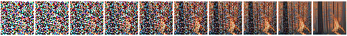
</div>

Put simply: starting from a frame of fuzz/static, SD finds details in each frame that it thinks look like "fire" and brings them a little bit more into focus, gradually scrubbing out the fuzz until a clear image remains.

**When you use `img2img`** some of the earlier steps are cut, and instead an initial image of your choice is used. But because of how the maths behind Stable Diffusion works, this image needs to be mixed with just the right amount of noise (fuzz/static) for where it is being inserted. This is where the strength parameter comes in. Depending on the set strength, your image will be inserted into the sequence at the appropriate point, with just the right amount of noise.

### A concrete example

I want SD to draw a fire based on this hand-drawn image:

<div align="center" markdown>
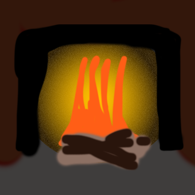
</div>

Let's only do 10 steps, to make it easier to see what's happening. If strength is `0.7`, this is what the internal steps the algorithm has to take will look like:

<div align="center" markdown>
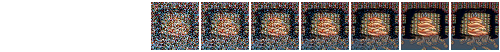
</div>

With strength `0.4`, the steps look more like this:

<div align="center" markdown>
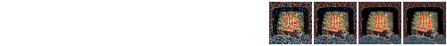
</div>

Notice how much more fuzzy the starting image is for strength `0.7` compared to `0.4`, and notice also how much longer the sequence is with `0.7`:

|  | strength = 0.7 | strength = 0.4 |
| -- | :--: | :--: |
| initial image that SD sees | 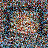 |  |
| steps argument to `dream>` | `-S10` | `-S10` |
| steps actually taken | 7 | 4 |
| latent space at each step |  |  |
| output | 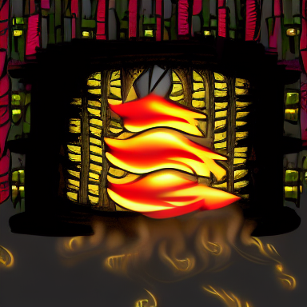 | 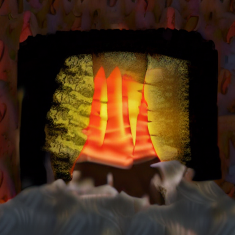 |

Both of the outputs look kind of like what I was thinking of. With the strength higher, my input becomes more vague, *and* Stable Diffusion has more steps to refine its output. But it's not really making what I want, which is a picture of cheery open fire. With the strength lower, my input is more clear, *but* Stable Diffusion has less chance to refine itself, so the result ends up inheriting all the problems of my bad drawing.

If you want to try this out yourself, all of these are using a seed of `1592514025` with a width/height of `384`, step count `10`, the default sampler (`k_lms`), and the single-word prompt `"fire"`:

```bash
invoke> "fire" -s10 -W384 -H384 -S1592514025 -I /tmp/fire-drawing.png --strength 0.7
```

The code for rendering intermediates is on my (damian0815's) branch [document-img2img](https://github.com/damian0815/InvokeAI/tree/document-img2img) - run `invoke.py` and check your `outputs/img-samples/intermediates` folder while generating an image.

### Compensating for the reduced step count

After putting this guide together I was curious to see how the difference would be if I increased the step count to compensate, so that SD could have the same amount of steps to develop the image regardless of the strength. So I ran the generation again using the same seed, but this time adapting the step count to give each generation 20 steps.

Here's strength `0.4` (note step count `50`, which is `20 ÷ 0.4` to make sure SD does `20` steps from my image):

```bash
invoke> "fire" -s50 -W384 -H384 -S1592514025 -I /tmp/fire-drawing.png -f 0.4
```

<div align="center" markdown>
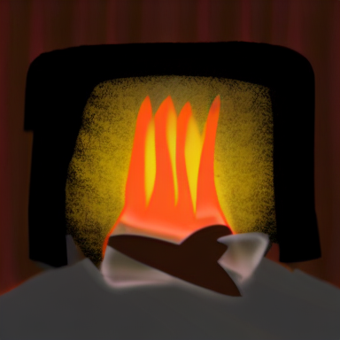
</div>

and here is strength `0.7` (note step count `30`, which is roughly `20 ÷ 0.7` to make sure SD does `20` steps from my image):

```bash
invoke> "fire" -s30 -W384 -H384 -S1592514025 -I /tmp/fire-drawing.png -f 0.7
```

<div align="center" markdown>
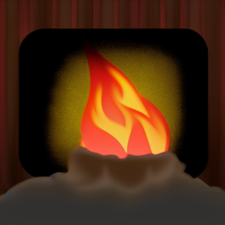
</div>

In both cases the image is nice and clean and "finished", but because at strength `0.7` Stable Diffusion has been give so much more freedom to improve on my badly-drawn flames, they've come out looking much better. You can really see the difference when looking at the latent steps. There's more noise on the first image with strength `0.7`:

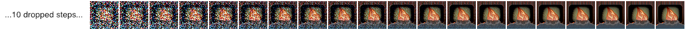

than there is for strength `0.4`:

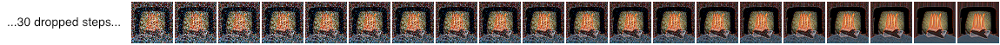

and that extra noise gives the algorithm more choices when it is evaluating how to denoise any particular pixel in the image.

Unfortunately, it seems that `img2img` is very sensitive to the step count. Here's strength `0.7` with a step count of `29` (SD did 19 steps from my image):

<div align="center" markdown>
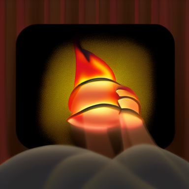
</div>

By comparing the latents we can sort of see that something got interpreted differently enough on the third or fourth step to lead to a rather different interpretation of the flames.


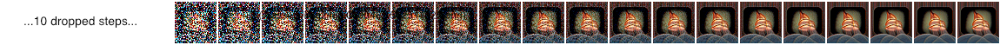

This is the result of a difference in the de-noising "schedule" - basically the noise has to be cleaned by a certain degree each step or the model won't "converge" on the image properly (see [stable diffusion blog](https://huggingface.co/blog/stable_diffusion) for more about that). A different step count means a different schedule, which means things get interpreted slightly differently at every step.
