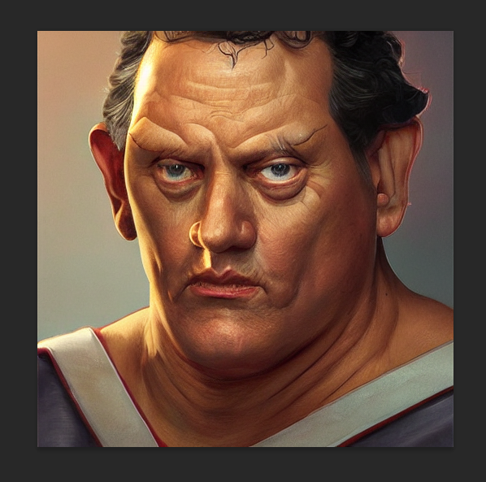
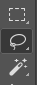
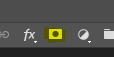
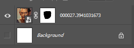
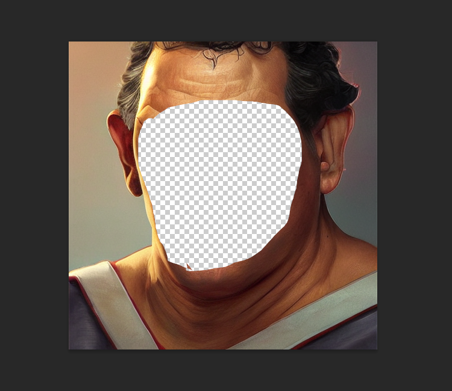
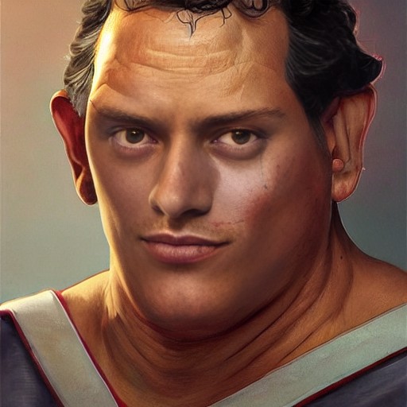

# :octicons-paintbrush-16: Inpainting

## **Creating Transparent Regions for Inpainting**

Inpainting is really cool. To do it, you start with an initial image and use a photoeditor to make
one or more regions transparent (i.e. they have a "hole" in them). You then provide the path to this
image at the invoke> command line using the `-I` switch. Stable Diffusion will only paint within the
transparent region.

There's a catch. In the current implementation, you have to prepare the initial image correctly so
that the underlying colors are preserved under the transparent area. Many imaging editing
applications will by default erase the color information under the transparent pixels and replace
them with white or black, which will lead to suboptimal inpainting. You also must take care to
export the PNG file in such a way that the color information is preserved.

If your photoeditor is erasing the underlying color information, `invoke.py` will give you a big fat
warning. If you can't find a way to coax your photoeditor to retain color values under transparent
areas, then you can combine the `-I` and `-M` switches to provide both the original unedited image
and the masked (partially transparent) image:

```bash
invoke> "man with cat on shoulder" -I./images/man.png -M./images/man-transparent.png
```

We are hoping to get rid of the need for this workaround in an upcoming release.

---

## Recipe for GIMP

[GIMP](https://www.gimp.org/) is a popular Linux photoediting tool.

1. Open image in GIMP.
2. Layer --> Transparency --> Add Alpha Channel
3. Use lasoo tool to select region to mask
4. Choose Select --> Float to create a floating selection
5. Open the Layers toolbar (++ctrl+l++) and select "Floating Selection"
6. Set opacity to a value between 0% and 99%
7. Export as PNG
8. In the export dialogue, Make sure the "Save colour values from
   transparent pixels" checkbox is selected.

---

## Recipe for Adobe Photoshop

1. Open image in Photoshop

    <div align="center" markdown></div>

2. Use any of the selection tools (Marquee, Lasso, or Wand) to select the area you desire to inpaint.

    <div align="center" markdown></div>

3. Because we'll be applying a mask over the area we want to preserve, you should now select the inverse by using the ++shift+ctrl+i++ shortcut, or right clicking and using the "Select Inverse" option.

4. You'll now create a mask by selecting the image layer, and Masking the selection. Make sure that you don't delete any of the undrlying image, or your inpainting results will be dramatically impacted.

    <div align="center" markdown></div>

5. Make sure to hide any background layers that are present. You should see the mask applied to your image layer, and the image on your canvas should display the checkered background.

    <div align="center" markdown></div>

6. Save the image as a transparent PNG by using `File`-->`Save a Copy` from the menu bar, or by using the keyboard shortcut ++alt+ctrl+s++

    <div align="center" markdown></div>

7. After following the inpainting instructions above (either through the CLI or the Web UI), marvel at your newfound ability to selectively invoke. Lookin' good!

    <div align="center" markdown></div>

8. In the export dialogue, Make sure the "Save colour values from transparent pixels" checkbox is selected.  
