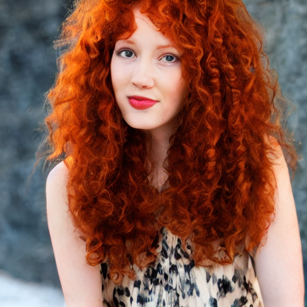
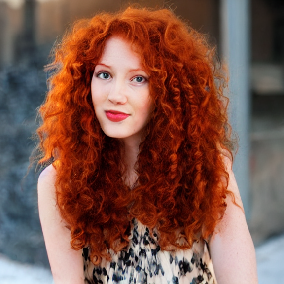
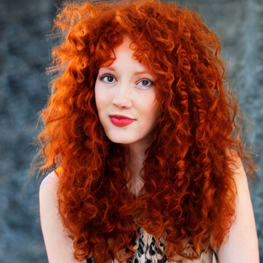

# :octicons-paintbrush-16: Outpainting

## Outpainting and outcropping

Outpainting is a process by which the AI generates parts of the image
that are outside its original frame. It can be used to fix up images
in which the subject is off center, or when some detail (often the top
of someone's head!) is cut off.

InvokeAI supports two versions of outpainting, one called "outpaint"
and the other "outcrop." They work slightly differently and each has
its advantages and drawbacks.

### Outcrop

The `outcrop` extension allows you to extend the image in 64 pixel
increments in any dimension. You can apply the module to any image
previously-generated by InvokeAI. Note that it will **not** work with
arbitrary photographs or Stable Diffusion images created by other
implementations.

Consider this image:



Pretty nice, but it's annoying that the top of her head is cut
off. She's also a bit off center. Let's fix that!

```bash
invoke> !fix images/curly.png --outcrop top 64 right 64
```

This is saying to apply the `outcrop` extension by extending the top
of the image by 64 pixels, and the right of the image by the same
amount. You can use any combination of top|left|right|bottom, and
specify any number of pixels to extend. You can also abbreviate
`--outcrop` to `-c`.

The result looks like this:

<div align="center" markdown>

</div>

The new image is actually slightly larger than the original (576x576,
because 64 pixels were added to the top and right sides.)

A number of caveats:

1. Although you can specify any pixel values, they will be rounded up
to the nearest multiple of 64. Smaller values are better. Larger
extensions are more likely to generate artefacts. However, if you wish
you can run the !fix command repeatedly to cautiously expand the
image.

2. The extension is stochastic, meaning that each time you run it
you'll get a slightly different result. You can run it repeatedly
until you get an image you like. Unfortunately `!fix` does not
currently respect the `-n` (`--iterations`) argument.

## Outpaint

The `outpaint` extension does the same thing, but with subtle
differences. Starting with the same image, here is how we would add an
additional 64 pixels to the top of the image:

```bash
invoke> !fix images/curly.png --out_direction top 64
```

(you can abbreviate `--out_direction` as `-D`.

The result is shown here:



Although the effect is similar, there are significant differences from
outcropping:

- You can only specify one direction to extend at a time.
- The image is **not** resized. Instead, the image is shifted by the specified
number of pixels. If you look carefully, you'll see that less of the lady's
torso is visible in the image.
- Because the image dimensions remain the same, there's no rounding
to multiples of 64.
- Attempting to outpaint larger areas will frequently give rise to ugly
   ghosting effects.
- For best results, try increasing the step number.
- If you don't specify a pixel value in `-D`, it will default to half
   of the whole image, which is likely not what you want.

!!! tip

    Neither `outpaint` nor `outcrop` are perfect, but we continue to tune
    and improve them. If one doesn't work, try the other. You may also
    wish to experiment with other `img2img` arguments, such as `-C`, `-f`
    and `-s`.
