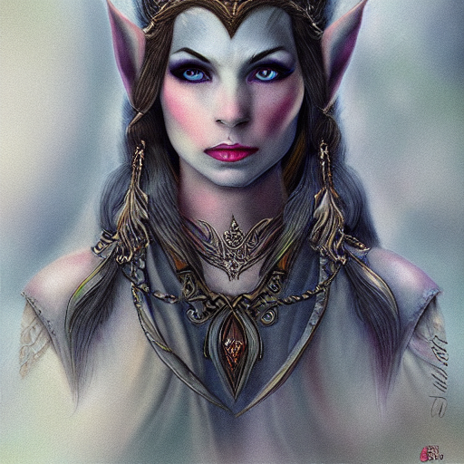
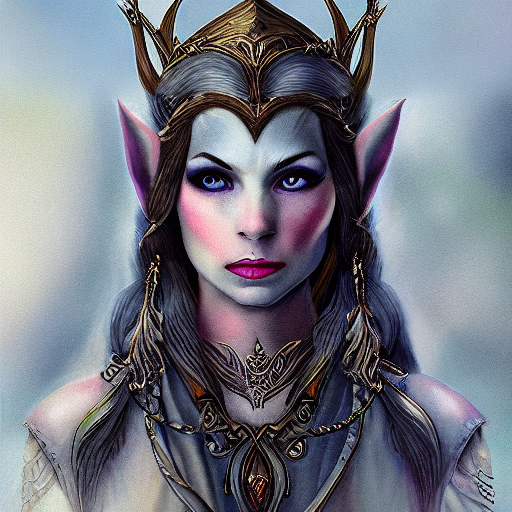

# :octicons-paintbrush-16: Outpainting

## Continous outpainting

This extension uses the inpainting code to extend an existing image to
any direction of "top", "right", "bottom" or "left". To use it you
need to provide an initial image with -I and an extension direction
with -D (direction). When extending using outpainting a higher img2img
strength value of 0.83 is the default.

The code is not foolproof. Sometimes it will do a good job extending
the image, and other times it will generate ghost images and other
artifacts. In addition, the code works best on images that were
generated by dream.py, because it will be able to recover the original
prompt that generated the file and "understand" what you are trying to
achieve.

### Basic Usage

To illustrate, consider this image generated with the prompt "fantasy
portrait of eleven princess." It's nice, but rather annoying that the
top of the head has been cropped off.

We can fix that using the `!fix` command!

~~~~
dream> !fix my_images/elven_princess.png -D top 50
~~~~

This is telling dream.py to open up a rectangle 50 pixels high at the
top of the image and outpaint into it. The result is:

Viola! You can similarly specify `bottom`, `left` or `right` to
outpaint into these margins.

There are some limitations to be aware of:

1. You cannot change the size of the image rectangle. In the example,
   notice that the whole image is shifted downwards by 50 pixels, rather
   than the top being extended upwards.

2. Attempting to outpaint larger areas will frequently give rise to ugly
   ghosting effects.

3. For best results, try increasing the step number.

4. If you don't specify a pixel value in -D, it will default to half
   of the whole image, which is likely not what you want.

You can do more with `!fix` including upscaling and facial
reconstruction of previously-generated images. See
[./UPSCALE.md#fixing-previously-generated-images] for the details.

### Advanced Usage

For more control over the outpaintihg process, you can provide the
`-D` option at image generation time. This allows you to apply all the
controls, including the ability to resize the image and apply face-fixing
and upscaling. For example:

~~~~
dream> man with cat on shoulder -I./images/man.png -D bottom 100 -W960 -H960 -fit
~~~~

Or even shorter, since the prompt is read from the metadata of the old image:

~~~~
dream> -I./images/man.png -D bottom 100 -W960 -H960 -fit -U2 -G1
~~~~

