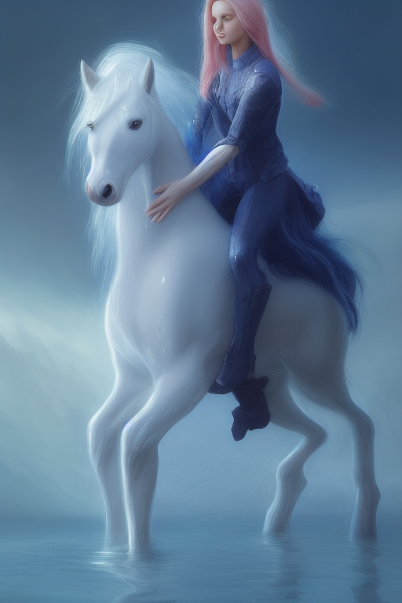
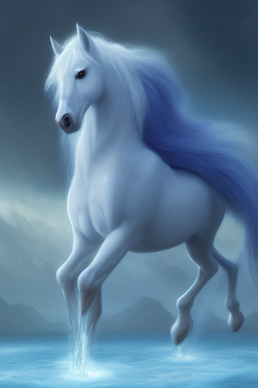
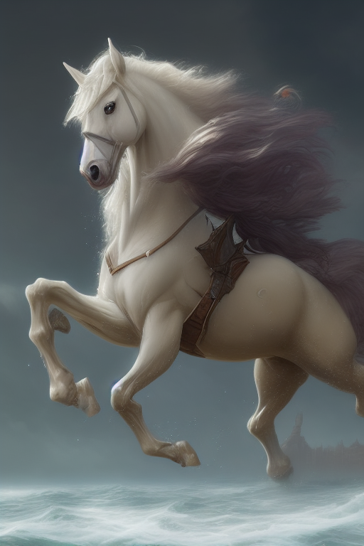
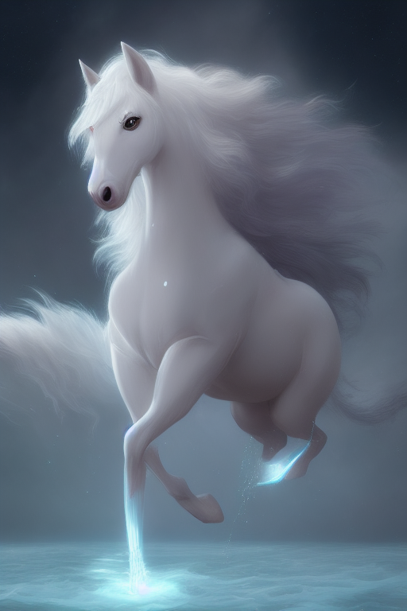
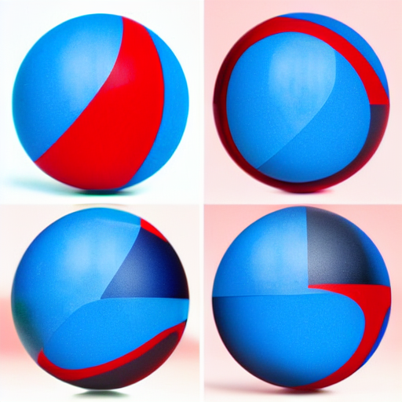
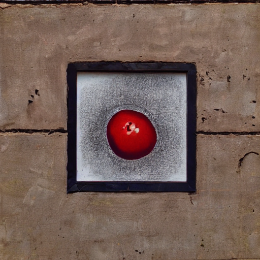
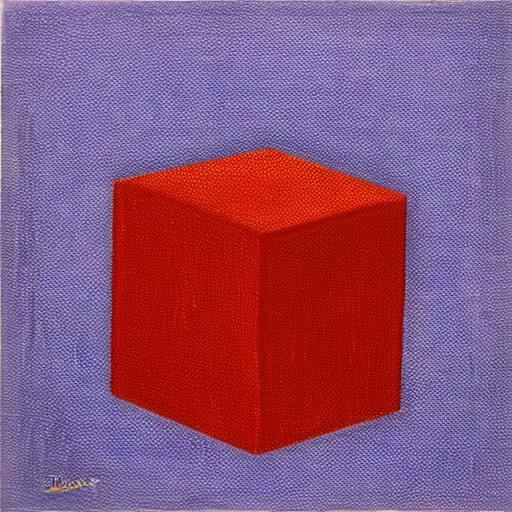

# :octicons-command-palette-24: Prompting-Features

## **Reading Prompts from a File**

You can automate `invoke.py` by providing a text file with the prompts you want to run, one line per
prompt. The text file must be composed with a text editor (e.g. Notepad) and not a word processor.
Each line should look like what you would type at the invoke> prompt:

```bash
a beautiful sunny day in the park, children playing -n4 -C10
stormy weather on a mountain top, goats grazing     -s100
innovative packaging for a squid's dinner           -S137038382
```

Then pass this file's name to `invoke.py` when you invoke it:

```bash
(invokeai) ~/stable-diffusion$ python3 scripts/invoke.py --from_file "path/to/prompts.txt"
```

You may read a series of prompts from standard input by providing a filename of `-`:

```bash
(invokeai) ~/stable-diffusion$ echo "a beautiful day" | python3 scripts/invoke.py --from_file -
```

---

## **Negative and Unconditioned Prompts**

Any words between a pair of square brackets will instruct Stable
Diffusion to attempt to ban the concept from the generated image.

```text
this is a test prompt [not really] to make you understand [cool] how this works.
```

In the above statement, the words 'not really cool` will be ignored by Stable Diffusion.

Here's a prompt that depicts what it does.

original prompt:

`#!bash "A fantastical translucent poney made of water and foam, ethereal, radiant, hyperalism, scottish folklore, digital painting, artstation, concept art, smooth, 8 k frostbite 3 engine, ultra detailed, art by artgerm and greg rutkowski and magali villeneuve" -s 20 -W 512 -H 768 -C 7.5 -A k_euler_a -S 1654590180`

<div align="center" markdown>

</div>

That image has a woman, so if we want the horse without a rider, we can influence the image not to have a woman by putting [woman] in the prompt, like this:

`#!bash "A fantastical translucent poney made of water and foam, ethereal, radiant, hyperalism, scottish folklore, digital painting, artstation, concept art, smooth, 8 k frostbite 3 engine, ultra detailed, art by artgerm and greg rutkowski and magali villeneuve [woman]" -s 20 -W 512 -H 768 -C 7.5 -A k_euler_a -S 1654590180`

<div align="center" markdown>

</div>

That's nice - but say we also don't want the image to be quite so blue. We can add "blue" to the list of negative prompts, so it's now [woman blue]:

`#!bash "A fantastical translucent poney made of water and foam, ethereal, radiant, hyperalism, scottish folklore, digital painting, artstation, concept art, smooth, 8 k frostbite 3 engine, ultra detailed, art by artgerm and greg rutkowski and magali villeneuve [woman blue]" -s 20 -W 512 -H 768 -C 7.5 -A k_euler_a -S 1654590180`

<div align="center" markdown>

</div>

Getting close - but there's no sense in having a saddle when our horse doesn't have a rider, so we'll add one more negative prompt: [woman blue saddle].

`#!bash "A fantastical translucent poney made of water and foam, ethereal, radiant, hyperalism, scottish folklore, digital painting, artstation, concept art, smooth, 8 k frostbite 3 engine, ultra detailed, art by artgerm and greg rutkowski and magali villeneuve [woman blue saddle]" -s 20 -W 512 -H 768 -C 7.5 -A k_euler_a -S 1654590180`

<div align="center" markdown>

</div>

!!! notes "Notes about this feature:"

    * The only requirement for words to be ignored is that they are in between a pair of square brackets.
    * You can provide multiple words within the same bracket.
    * You can provide multiple brackets with multiple words in different places of your prompt. That works just fine.
    * To improve typical anatomy problems, you can add negative prompts like `[bad anatomy, extra legs, extra arms, extra fingers, poorly drawn hands, poorly drawn feet, disfigured, out of frame, tiling, bad art, deformed, mutated]`.

---

## **Prompt Blending**

You may blend together different sections of the prompt to explore the
AI's latent semantic space and generate interesting (and often
surprising!) variations. The syntax is:

```bash
blue sphere:0.25 red cube:0.75 hybrid
```

This will tell the sampler to blend 25% of the concept of a blue
sphere with 75% of the concept of a red cube. The blend weights can
use any combination of integers and floating point numbers, and they
do not need to add up to 1. Everything to the left of the `:XX` up to
the previous `:XX` is used for merging, so the overall effect is:

```bash
0.25 * "blue sphere" + 0.75 * "white duck" + hybrid
```

Because you are exploring the "mind" of the AI, the AI's way of mixing
two concepts may not match yours, leading to surprising effects. To
illustrate, here are three images generated using various combinations
of blend weights. As usual, unless you fix the seed, the prompts will give you
different results each time you run them.

---

<div align="center" markdown>
### "blue sphere, red cube, hybrid"
</div>

This example doesn't use melding at all and represents the default way
of mixing concepts.

<div align="center" markdown>

</div>

It's interesting to see how the AI expressed the concept of "cube" as
the four quadrants of the enclosing frame. If you look closely, there
is depth there, so the enclosing frame is actually a cube.

<div align="center" markdown>
### "blue sphere:0.25 red cube:0.75 hybrid"


</div>

Now that's interesting. We get neither a blue sphere nor a red cube,
but a red sphere embedded in a brick wall, which represents a melding
of concepts within the AI's "latent space" of semantic
representations. Where is Ludwig Wittgenstein when you need him?

<div align="center" markdown>
### "blue sphere:0.75 red cube:0.25 hybrid"


</div>

Definitely more blue-spherey. The cube is gone entirely, but it's
really cool abstract art.

<div align="center" markdown>
### "blue sphere:0.5 red cube:0.5 hybrid"


</div>

Whoa...! I see blue and red, but no spheres or cubes. Is the word
"hybrid" summoning up the concept of some sort of scifi creature?
Let's find out.

<div align="center" markdown>
### "blue sphere:0.5 red cube:0.5"


</div>

Indeed, removing the word "hybrid" produces an image that is more like
what we'd expect.

In conclusion, prompt blending is great for exploring creative space,
but can be difficult to direct. A forthcoming release of InvokeAI will
feature more deterministic prompt weighting.
