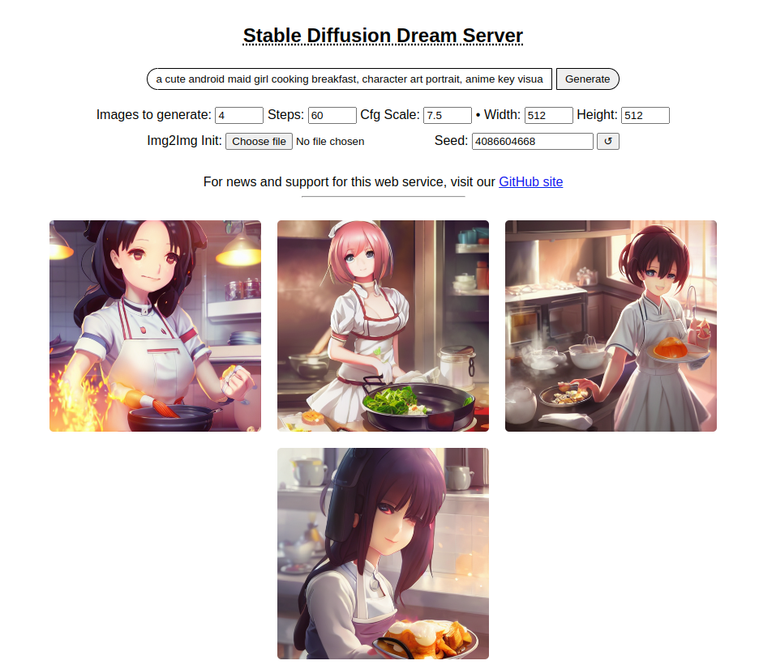

# :material-web: Barebones Web Server

As of version 1.10, this distribution comes with a bare bones web server (see
screenshot). To use it, run the `dream.py` script by adding the `--web`
option.

```bash
(ldm) ~/stable-diffusion$ python3 scripts/dream.py --web
```

You can then connect to the server by pointing your web browser at
http://localhost:9090, or to the network name or IP address of the server.

Kudos to [Tesseract Cat](https://github.com/TesseractCat) for contributing this
code, and to [dagf2101](https://github.com/dagf2101) for refining it.


