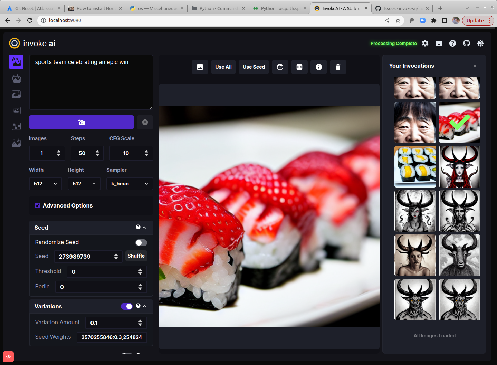

As of version 2.0.0, this distribution comes with a full-featured web
server (see screenshot). To use it, run the `invoke.py` script by
adding the `--web` option:

```bash
(ldm) ~/InvokeAI$ python3 scripts/invoke.py --web
```

You can then connect to the server by pointing your web browser at
http://localhost:9090. To reach the server from a different machine on
your LAN, you may launch the web server with the `--host` argument and
either the IP address of the host you are running it on, or the
wildcard `0.0.0.0`. For example:

```bash
(ldm) ~/InvokeAI$ python3 scripts/invoke.py --web --host 0.0.0.0
```

Kudos to [Psychedelicious](https://github.com/psychedelicious),
[BlessedCoolant](https://github.com/blessedcoolant), [Tesseract
Cat](https://github.com/TesseractCat),
[dagf2101](https://github.com/dagf2101), and many others who
contributed to this code.


