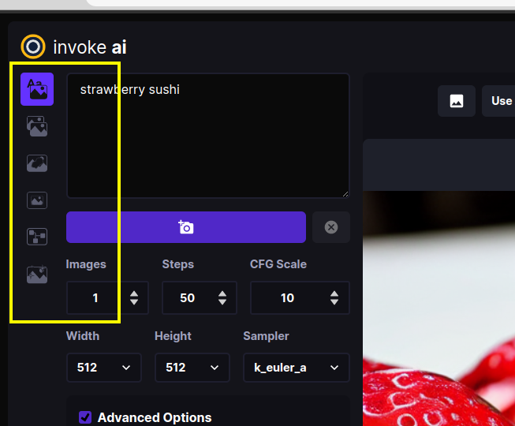
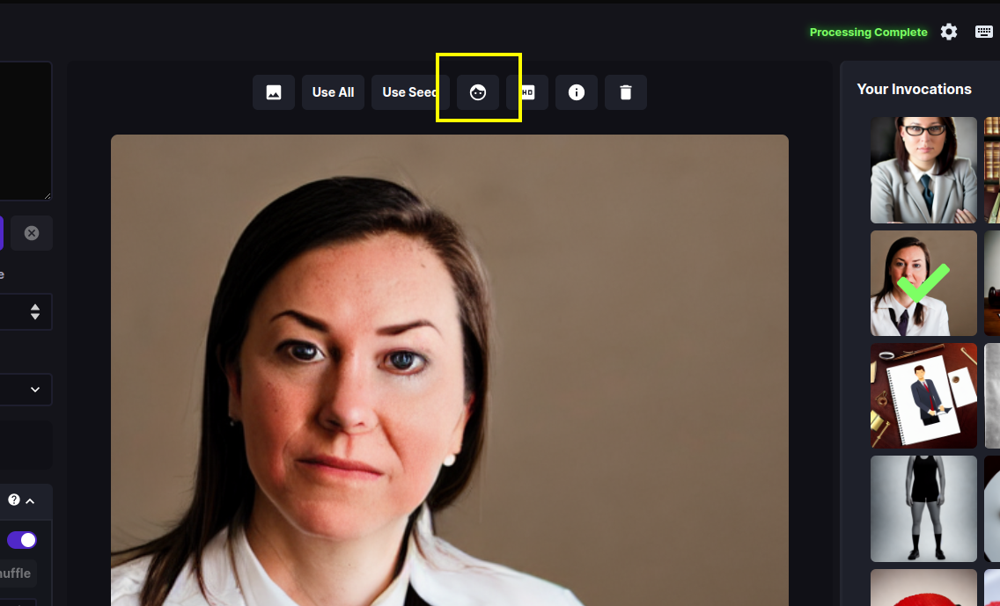
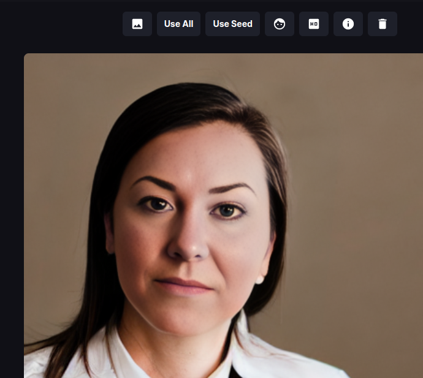
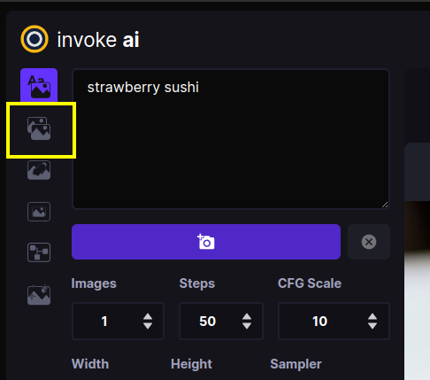
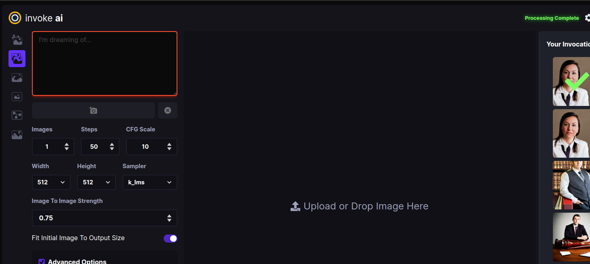
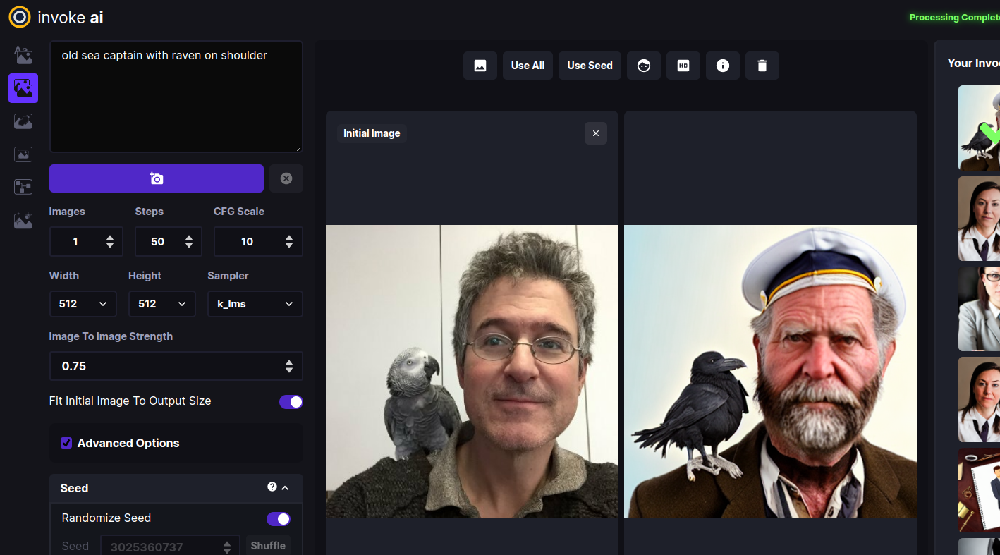
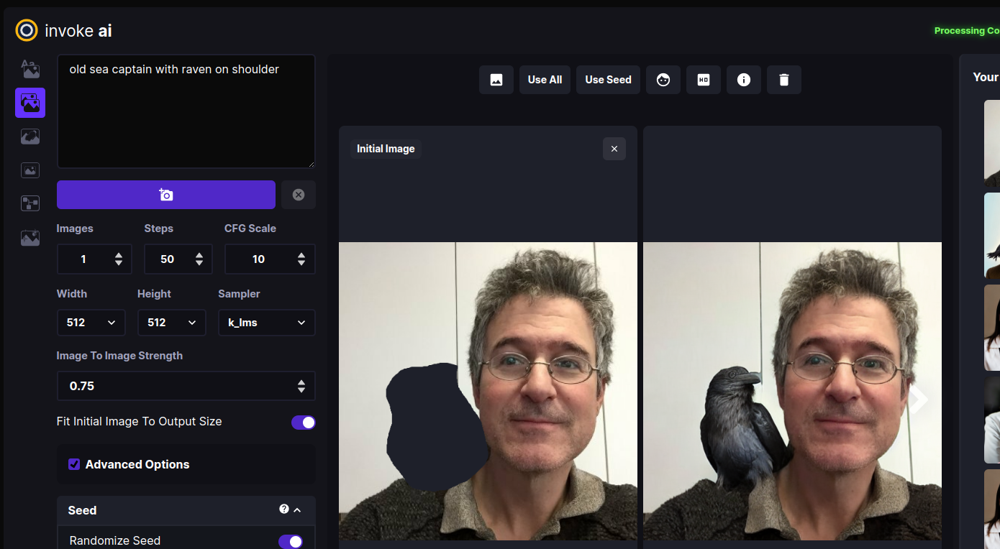
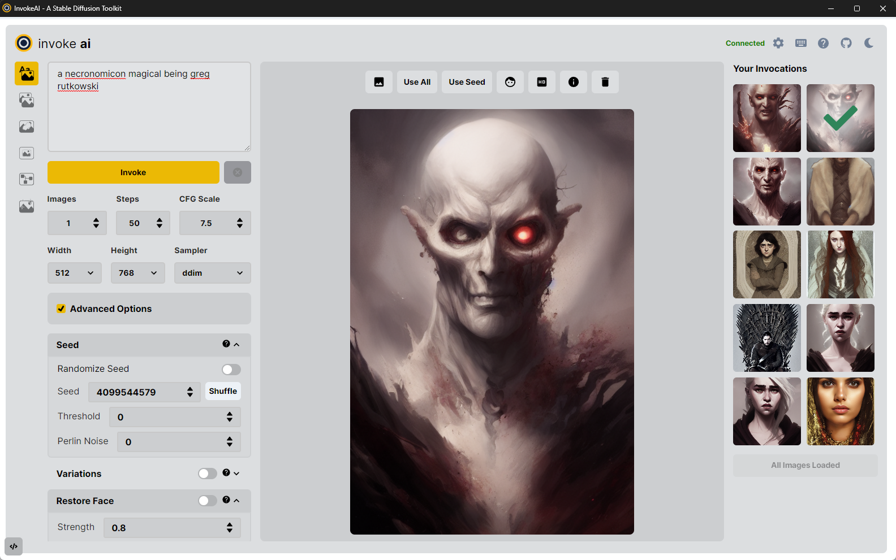

# :material-web: InvokeAI Web Server

As of version 2.0.0, this distribution comes with a full-featured web
server (see screenshot). To use it, run the `invoke.py` script by
adding the `--web` option:

```bash
(invokeai) ~/InvokeAI$ python3 scripts/invoke.py --web
```

You can then connect to the server by pointing your web browser at
http://localhost:9090. To reach the server from a different machine on
your LAN, you may launch the web server with the `--host` argument and
either the IP address of the host you are running it on, or the
wildcard `0.0.0.0`. For example:

```bash
(invokeai) ~/InvokeAI$ python3 scripts/invoke.py --web --host 0.0.0.0
```

# Quick guided walkthrough of the WebGUI's features

While most of the WebGUI's features are intuitive, here is a guided
walkthrough through its various components.

{:width="640px"}

The screenshot above shows the Text to Image tab of the WebGUI. There
are three main sections:

1. A **control panel** on the left, which contains various settings
for text to image generation. The most important part is the text
field (currently showing `strawberry sushi`) for entering the text
prompt, and the camera icon directly underneath that will render the
image. We'll call this the *Invoke* button from now on.

2. The **current image** section in the middle, which shows a large
format version of the image you are currently working on. A series of
buttons at the top ("image to image", "Use All", "Use Seed", etc) lets
you modify the image in various ways.

3. A **gallery* section on the left that contains a history of the
images you have generated. These images are read and written to the
directory specified at launch time in `--outdir`.

In addition to these three elements, there are a series of icons for
changing global settings, reporting bugs, and changing the theme on
the upper right.

There are also a series of icons to the left of the control panel (see
highlighted area in the screenshot below) which select among a series
of tabs for performing different types of operations.

<figure markdown>
{:width="512px"}
</figure>

From top to bottom, these are:

1. Text to Image  - generate images from text
2. Image to Image - from an uploaded starting image (drawing or photograph) generate a new one, modified by the text prompt
3. Inpainting (pending) - Interactively erase portions of a starting image and have the AI fill in the erased region from a text prompt.
4. Outpainting (pending) - Interactively add blank space to the borders of a starting image and fill in the background from a text prompt.
5. Postprocessing (pending) - Interactively postprocess generated images using a variety of filters.

The inpainting, outpainting and postprocessing tabs are currently in
development. However, limited versions of their features can already
be accessed through the Text to Image and Image to Image tabs.

## Walkthrough

The following walkthrough will exercise most (but not all) of the
WebGUI's feature set.

### Text to Image

1. Launch the WebGUI using `python scripts/invoke.py --web` and
connect to it with your browser by accessing
`http://localhost:9090`. If the browser and server are running on
different machines on your LAN, add the option `--host 0.0.0.0` to the
launch command line and connect to the machine hosting the web server
using its IP address or domain name.

2. If all goes well, the WebGUI should come up and you'll see a green
`connected` message on the upper right.

#### Basics

1. Generate an image by typing *strawberry sushi* into the large
prompt field on the upper left and then clicking on the Invoke button
(the one with the Camera icon). After a short wait, you'll see a large
image of sushi in the image panel, and a new thumbnail in the gallery
on the right.

    If you need more room on the screen, you can turn the gallery  off
    by clicking on the **x** to the right of "Your Invocations". You can
    turn it back on later by clicking the image icon that appears in the
    gallery's place.

    The images are written into the directory indicated by the `--outdir`
    option provided at script launch time. By default, this is
    `outputs/img-samples` under the InvokeAI directory.

2. Generate a bunch of strawberry sushi images by increasing the
number of requested images by adjusting the Images counter just below
the Camera button. As each is generated, it will be added to the
gallery. You can switch the active image by clicking on the gallery
thumbnails.

3. Try playing with different settings, including image width and
height, the Sampler, the Steps and the CFG scale.

    Image *Width* and *Height* do what you'd expect. However, be aware that
    larger images consume more VRAM memory and take longer to generate.

    The *Sampler* controls how the AI selects the image to display. Some
    samplers are more "creative" than others and will produce a wider
    range of variations (see next section). Some samplers run faster than
    others.

    *Steps* controls how many noising/denoising/sampling steps the AI will
    take. The higher this value, the more refined the image will be, but
    the longer the image will take to generate. A typical strategy is to
    generate images with a low number of steps in order to select one to
    work on further, and then regenerate it using a higher number of
    steps.

    The *CFG Scale* controls how hard the AI tries to match the generated
    image to the input prompt. You can go as high or low as you like, but
    generally values greater than 20 won't improve things much, and values
    lower than 5 will produce unexpected images. There are complex
    interactions between *Steps*, *CFG Scale* and the *Sampler*, so
    experiment to find out what works for you.

6. To regenerate a previously-generated image, select the image you
want and click *Use All*. This loads the text prompt and other
original settings into the control panel. If you then press *Invoke*
it will regenerate the image exactly. You can also selectively modify
the prompt or other settings to tweak the image.

    Alternatively, you may click on *Use Seed* to load just the image's
    seed, and leave other settings unchanged.

7. To regenerate a Stable Diffusion image that was generated by
another SD package, you need to know its text prompt and its
*Seed*. Copy-paste the prompt into the prompt box, unset the
*Randomize Seed* control in the control panel, and copy-paste the
desired *Seed* into its text field. When you Invoke, you will get
something similar to the original image. It will not be exact unless
you also set the correct values for the original sampler, CFG,
steps and dimensions, but it will (usually) be close.

#### Variations on a theme

1. Let's try generating some variations. Select your favorite sushi
image from the gallery to load it. Then select "Use All" from the list
of buttons above. This will load up all the settings used to generate
this image, including its unique seed.

    Go down to the Variations section of the Control Panel and set the
    button to On. Set Variation Amount to 0.2 to generate a modest
    number of variations on the image, and also set the Image counter to
    `4`. Press the `invoke` button. This will generate a series of related
    images. To obtain smaller variations, just lower the Variation
    Amount. You may also experiment with changing the Sampler. Some
    samplers generate more variability than others. *k_euler_a* is
    particularly creative, while *ddim* is pretty conservative.

2. For even more variations, experiment with increasing the setting
for *Perlin*. This adds a bit of noise to the image generation
process. Note that values of Perlin noise greater than 0.15 produce
poor images for several of the samplers.

#### Facial reconstruction and upscaling

Stable Diffusion frequently produces mangled faces, particularly when
there are multiple figures in the same scene. Stable Diffusion has
particular issues with generating reallistic eyes. InvokeAI provides
the ability to reconstruct faces using either the GFPGAN or CodeFormer
libraries. For more information see [POSTPROCESS](POSTPROCESS.md).
  
1. Invoke a prompt that generates a mangled face. A prompt that often
gives this is "portrait of a lawyer, 3/4 shot" (this is not intended
as a slur against lawyers!) Once you have an image that needs some
touching up, load it into the Image panel, and press the button with
the face icon (highlighted in the first screenshot below). A dialog
box will appear. Leave *Strength* at 0.8 and press *Restore Faces". If
all goes well, the eyes and other aspects of the face will be improved
(see the second screenshot)

    

    

    The facial reconstruction *Strength* field adjusts how aggressively
    the face library will try to alter the face. It can be as high as 1.0,
    but be aware that this often softens the face airbrush style, losing
    some details. The default 0.8 is usually sufficient.

2. "Upscaling" is the process of increasing the size of an image while
retaining the sharpness. InvokeAI uses an external library called
"ESRGAN" to do this. To invoke upscaling, simply select an image and
press the *HD* button above it. You can select between 2X and 4X
upscaling, and adjust the upscaling strength, which has much the same
meaning as in facial reconstruction. Try running this on one of your
previously-generated images.

3. Finally, you can run facial reconstruction and/or upscaling
automatically after each Invocation. Go to the Advanced Options
section of the Control Panel and turn on *Restore Face* and/or
*Upscale*.

### Image to Image

InvokeAI lets you take an existing image and use it as the basis for a
new creation. You can use any sort of image, including a photograph, a
scanned sketch, or a digital drawing, as long as it is in PNG or JPEG
format.

For this tutorial, we'll use files named
[Lincoln-and-Parrot-512.png](../assets/Lincoln-and-Parrot-512.png),
and
[Lincoln-and-Parrot-512-transparent.png](../assets/Lincoln-and-Parrot-512-transparent.png).
Download these images to your local machine now to continue with the walkthrough.

1. Click on the *Image to Image* tab icon, which is the second icon
from the top on the left-hand side of the screen:

    <figure markdown>
    
    </figure>

    This will bring you to a screen similar to the one shown here:

    <figure markdown>
    {:width="640px"}
    </figure>

2. Drag-and-drop the Lincoln-and-Parrot image into the Image panel, or
click the blank area to get an upload dialog. The image will load into
an area marked *Initial Image*. (The WebGUI will also load the most
recently-generated image from the gallery into a section on the left,
but this image will be replaced in the next step.)

3. Go to the prompt box and type *old sea captain with raven on
shoulder* and press Invoke. A derived image will appear to the right
of the original one:

    {:width="640px"}

4. Experiment with the different settings. The most influential one
in Image to Image is *Image to Image Strength* located about midway
down the control panel. By default it is set to 0.75, but can range
from 0.0 to 0.99. The higher the value, the more of the original image
the AI will replace. A value of 0 will leave the initial image
completely unchanged, while 0.99 will replace it completely. However,
the Sampler and CFG Scale also influence the final result. You can
also generate variations in the same way as described in Text to
Image.

5. What if we only want to change certain part(s) of the image and
leave the rest intact? This is called Inpainting, and a future version
of the InvokeAI web server will provide an interactive painting canvas
on which you can directly draw the areas you wish to Inpaint into. For
now, you can achieve this effect by using an external photoeditor tool
to make one or more regions of the image transparent as described in
[INPAINTING.md] and uploading that.

    The file
    [Lincoln-and-Parrot-512-transparent.png](../assets/Lincoln-and-Parrot-512-transparent.png)
    is a version of the earlier image in which the area around the parrot
    has been replaced with transparency. Click on the "x" in the upper
    right of the Initial Image and upload the transparent version. Using
    the same prompt "old sea captain with raven on shoulder" try Invoking
    an image. This time, only the parrot will be replaced, leaving the
    rest of the original image intact:

<figure markdown>
{:width="640px"}
</figure>

6. Would you like to modify a previously-generated image using the
Image to Image facility? Easy! While in the Image to Image panel,
hover over any of the gallery images to see a little menu of icons pop
up.  Click the picture icon to instantly send the selected image to
Image to Image as the initial image.

You can do the same from the Text to Image tab by clicking on the
picture icon above the central image panel. The screenshot below
shows where the "use as initial image" icons are located.

{:width="640px"}

## Parting remarks

This concludes the walkthrough, but there are several more features that you
can explore. Please check out the [Command Line Interface](CLI.md)
documentation for further explanation of the advanced features that
were not covered here.

The WebGUI is only rapid development. Check back regularly for
updates!

## Reference

### Additional Options

 parameter  | effect
-- | --
`--web_develop` | Starts the web server in development mode.
`--web_verbose` | Enables verbose logging
`--cors [CORS ...]` | Additional allowed origins, comma-separated
`--host HOST` | Web server: Host or IP to listen on. Set to 0.0.0.0 to accept traffic from other devices on your network.
`--port PORT` | Web server: Port to listen on
`--gui` | Start InvokeAI GUI - This is the "desktop mode" version of the web app. It uses Flask to create a desktop app experience of the webserver.

### Web Specific Features

The web experience offers an incredibly easy-to-use experience for interacting with the InvokeAI toolkit. 
For detailed guidance on individual features, see the Feature-specific help documents available in this directory.
Note that the latest functionality available in the CLI may not always be available in the Web interface.

#### Dark Mode & Light Mode

The InvokeAI interface is available in a nano-carbon black & purple Dark Mode, and a "burn your eyes out Nosferatu" Light Mode. These can be toggled by clicking the Sun/Moon icons at the top right of the interface. 




#### Invocation Toolbar

The left side of the InvokeAI interface is available for customizing the prompt and the settings used for invoking your new image. Typing your prompt into the open text field and clicking the Invoke button will produce the image based on the settings configured in the toolbar.

See below for additional documentation related to each feature:

- [Core Prompt Settings](./CLI.md)
- [Variations](./VARIATIONS.md)
- [Upscaling](./POSTPROCESS.md#upscaling)
- [Image to Image](./IMG2IMG.md)
- [Inpainting](./INPAINTING.md)
- [Other](./OTHER.md)

#### Invocation Gallery

The currently selected --outdir (or the default outputs folder) will display all previously generated files on load. As new invocations are generated, these will be dynamically added to the gallery, and can be previewed by selecting them. Each image also has a simple set of actions (e.g., Delete, Use Seed, Use All Parameters, etc.) that can be accessed by hovering over the image.

#### Image Workspace

When an image from the Invocation Gallery is selected, or is generated, the image will be displayed within the center of the interface. A quickbar of common image interactions are displayed along the top of the image, including:

- Use image in the `Image to Image` workflow
- Initialize Face Restoration on the selected file
- Initialize Upscaling on the selected file
- View File metadata and details
- Delete the file

## Acknowledgements

A huge shout-out to the core team working to make this vision a
reality, including
[psychedelicious](https://github.com/psychedelicious),
[Kyle0654](https://github.com/Kyle0654) and
[blessedcoolant](https://github.com/blessedcoolant). [hipsterusername](https://github.com/hipsterusername)
was the team's unofficial cheerleader and added tooltips/docs.
